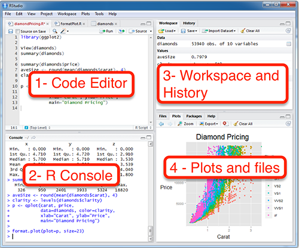

```{r, echo=FALSE, message=FALSE, warning=FALSE}
library(readxl)
library(dplyr)
library(readr)
library(lessR)
library(ggplot2)
library(ggpubr)
library(cowplot)
library(patchwork)
library(palmerpenguins)
library(car)
library(ggforce) # for geom_circle
library(RVAideMemoire) #shapiro.test
library(DiagrammeR)
#knitr::opts_chunk$set(dpi= 100)
xaringanExtra::use_panelset()
xaringanExtra::use_scribble()
xaringanExtra::use_search(show_icon = FALSE, position= "bottom-left") # Search
xaringanExtra::use_progress_bar(color = "#0051BA", location = "bottom", 
                                height = "4px")
xaringanExtra::use_clipboard() # Copy Code 
xaringanExtra::use_extra_styles(
  hover_code_line = TRUE,         #<<
  mute_unhighlighted_code = TRUE  #<<
)
xaringanExtra::use_editable(expires = 1) # Add textboxes to edit during presentation
```

# What is R Programming?
- R is a free and open source software environment and programming language for statistics.

- R was created by Ross Ihaka and Robert Gentleman at the University
of Auckland (in New Zealand), and is based on the S language that
was created by John Chambers at Bell Laboratories.

.center[
```{r, echo=FALSE, fig.cap="", out.width = '50%'}
knitr::include_graphics("fig/creadores_r.png")
```
]

---
# What is R Programming?
- When you download and install R, you get a collection of basic packages (and libraries) that can be used to implement several common data manipulations, graphical displays, and statistical models.
.center[
```{r, echo=FALSE, fig.cap="", out.width = '30%'}
knitr::include_graphics("fig/meme.jpg")
```
]

---
# Strengths and Weaknesses
* **Strengths:**  
-Free and Open Source.  
-Strong User Community.  
-Highly extensible, flexible.  
-Implementation of high-end statistical methods.  
-Flexible graphics and intelligent defaults.  

--

* **Weakness:**  
-Steep learning curve.  
-Slow for large datasets. 

---
# Why R?
- **Computing power**: R can handle much larger datasets than traditional programs, which is especially important for long-term ecological data, community science data, and public health data.

--

- **Flexibility & convenience**: Traditionally, scientists would need separate programs for data cleaning, statistical procedures, and data visualization.  
Learning R means you can do everything in a single program, and
customize to fit the goals of your project.

--

- **Reproducibility**: Saving your code as an R script makes it easy for other scientists to see what you did, and repeat your methods.

---
# R Overview

---
# How to download?
- Google it using R or CRAN (Comprehensive R Archive Network)  
  - http://www.r-project.org

---
# How to download?
- Having installed R, the next thing we will want to do is install **RStudio**, a popular and useful interface for writing scripts and using R.

- If you google **RStudio** you will get to this window:  
https://www.rstudio.com/products/rstudio/download/ 

- Rstudio is an ***integrated development environment (IDE)*** for R that allows users to interact more easily with R by integrating different aspects of scripting, from code completion to debugging.

---
# Typical Rstudio session

.pull-left[
- **Code Editor**: Contains code to tell R what to do.  
- Save scripts for future use.
]

.pull-right[
```{r, echo=FALSE, fig.cap="", out.width = '100%'}

```
]

---
# Typical Rstudio session

.pull-left[
- **Console**: output & temporary input - usually unsaved.
]

.pull-right[
```{r, echo=FALSE, fig.cap="", out.width = '100%'}

```
]

---
# Typical Rstudio session

.pull-left[
- **Workspace**: Stores objects created during the session.  Save with save.image().
- **History**: Records commands used.  Save with savehistory().
]

.pull-right[
```{r, echo=FALSE, fig.cap="", out.width = '100%'}

```
]

---
# Typical Rstudio session

.pull-left[
- **Plots**: Displays graphs.  Save plots with ggsave().
- **Files**: Shows files in the working directory.
]

.pull-right[
```{r, echo=FALSE, fig.cap="", out.width = '100%'}

```
]

---
# Create an account in GitHub

---
# Create an account in GitHub
- Create and account in .link-style2[[GitHub](https://github.com/)]

---
# Create a repository
- Create a `Repository` for this course.
    - `New`
    - Create a new repository
    - add a name
    - Click `public`
    - `Add a README file`
    - Add a .gitignore file
        - `R`
    - Add a license
        - `MIT`
    - Click `Create repository`
    - Add a description (optional)

---
# Clone the repository

- Clone the repository to your computer
    - Click on `Code`
    - Copy the URL

---
# Create a project in RStudio in your computer

1. Open RStudio on your computer.
2. In the top menu, go to `File` > `New Project....`
3. A window will pop up. Select the option:
    - `Version Control` > `Git`.
4. Paste the Git repository URL in the provided field.
5. Choose the directory where you'd like to store your project.
6. Click `Create Project` to initialize your RStudio project connected to Git.


    
    


