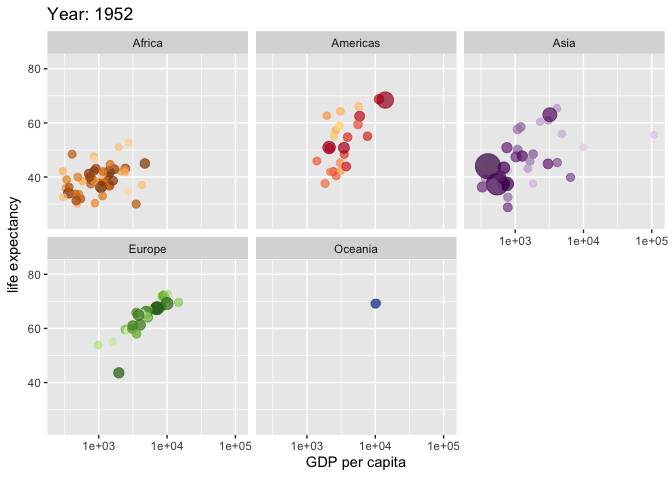

```{r, echo=FALSE, message=FALSE, warning=FALSE}
library(readxl)
library(dplyr)
library(readr)
library(lessR)
library(ggplot2)
library(ggpubr)
library(cowplot)
library(patchwork)
library(palmerpenguins)
library(car)
library(ggforce) # for geom_circle
library(RVAideMemoire) #shapiro.test
library(DiagrammeR)
#knitr::opts_chunk$set(dpi= 100)
library(countdown)
library(knitr)
library(kableExtra)
xaringanExtra::use_panelset()
xaringanExtra::use_scribble()
xaringanExtra::use_search(show_icon = FALSE, position= "bottom-left") # Search
xaringanExtra::use_progress_bar(color = "#0051BA", location = "bottom", 
                                height = "4px")
xaringanExtra::use_clipboard() # Copy Code 
xaringanExtra::use_extra_styles(
  hover_code_line = TRUE,         #<<
  mute_unhighlighted_code = TRUE  #<<
)
xaringanExtra::use_editable(expires = 1) # Add textboxes to edit during presentation
```

<br><br><br>
<center>
```{r, echo=FALSE, fig.cap="", out.width = '50%'}

```
<center>


---
exclude: true
https://pkg.garrickadenbuie.com/countdown/#1
```{r, echo=FALSE}
countdown::countdown(minutes=1,seconds= 0, right = "33%", bottom = "0%", warn_when = 30)
```

https://bookdown.org/jgscott/DSGI/plots.html
https://bookdown.org/ybrandvain/Applied-Biostats/viz1.html#ref-whitlock2020
https://irene.vrbik.ok.ubc.ca/quarto/data101/lecture08.html#/title-slide

---
# What is `ggplot2`?
- An implementation of the [**Grammar of  Graphics**](https://link.springer.com/book/10.1007/0-387-28695-0) proposed by **Leland Wilkinson (2005)**.  

- Developed by [**Hadley Wickham**](https://hadley.nz/) while a graduate student at Iowa State University.  *(He still maintains it!)*  

- Represents a **third graphics system** for R — alongside **base** and **lattice** graphics.  

---
# What is `Grammar of Graphics`?
- Created by **Leland Wilkinson (2005)** to define the **fundamental building blocks** of statistical graphics. 

- The grammar provides a **structured way** to describe how plots are built.
<br>
--
<br>
- Every graphic is made by combining independent components:
  - **Data** → what you want to visualize  
  - **Aesthetics (`aes`)** → mapping of variables to color, shape, size   
  - **Geoms** → visual marks (points, lines, bars)  
  - **Stats** → statistical summaries or transformations  
  - **Scales, Coords, Facets, Theme** → control layout and appearance  

---
# How `ggplot2` builds on the Grammar?
- Built on the [**Grammar of Graphics**](https://link.springer.com/book/10.1007/0-387-28695-0) (the *"gg"* in `ggplot2`) it provides a **consistent system** for creating and customizing plots.
<br>
--
<br>
- 💡 The **Grammar of Graphics** is like **language grammar**:  
  just as learning a few verbs, nouns, and adjectives lets you form countless sentences, learning the basic **`ggplot2` building blocks** lets you create hundreds of different plots without memorizing each one.
<br>
--
<br>
- The key idea:  
  - separate **what** is graphed (the data)  
  - from **how** it is graphed (the visualization).  
   
---
# Why `ggplot2`?
- `ggplot2` is one of the most widely used packages for data visualization in R.

- Its **thoughtful defaults** make it easy for beginners to produce clear, elegant, and informative graphs with **minimal, readable code**.


---
# Why `ggplot2`?
- Key strengths:
<br><br>
- 💪 **Flexible and powerful**  
    - Build virtually any type of visualization by layering components.

--

- 🖼️ **Publication-quality graphics**  
    - Create clean, elegant, and customizable figures with minimal effort.

--

- 🔗 **Strong integration with the tidyverse**  
    - Works naturally with `dplyr`, `tidyr`, and other tidyverse tools for a smooth data-to-plot workflow.

---
# Why `ggplot2`?
- Together with other [extensions](https://exts.ggplot2.tidyverse.org/gallery/), it provides even more powerful tools for advanced visualization.

- Be aware there are other visualization tools as well, such as:
  - [tidyplots](https://tidyplots.org/use-cases/): useful for simplified and structured visualization workflows
  - [plotly](https://plotly.com/r/): for interactive plots
  - [r-charts](https://r-charts.com/?utm_source=chatgpt.com): for exploring diverse chart types with reproducible ggplot2 code

---
# What makes `ggplot2` special?
- **Layered approach to plotting**
- You build plots step-by-step:<br>
    - `data → aesthetics → geoms → scales/themes (optional)`
    
- Each component is added as a separate layer using the `+` operator

--

**Why it matters:**
  1. Few code changes = very different plots
  2. Easy to reuse and adapt code
  3. Extensions unlock even more plot types

- 💡 Works best with **[tidy data](https://r4ds.had.co.nz/tidy-data.html)** (rows = observations, columns = variables)


---
# Basic Structure of a `ggplot2` plot

To build a plot in **ggplot2**, we start with the data and then *add layers*.  
Each line below represents a component that you can include to customize your plot.

```{r eval=F}
ggplot(data = <DATA>) +       # 1️⃣ Specify the dataset to be plotted
  <GEOM_FUNCTION>(            # 2️⃣ Choose a geometry (type of plot: points, bars, lines…)
    mapping = aes(<MAPPINGS>),# 3️⃣ Map variables to aesthetics (x, y, color, size…)
    stat = <STAT>,            # 4️⃣ (Optional) Statistical transformation (e.g., "identity", "summary")
    position = <POSITION>     # 5️⃣ (Optional) Adjust position (e.g., dodge, stack, jitter)
  ) +
  <COORDINATE_FUNCTION> +     # 6️⃣ (Optional) Change coordinate system (e.g., flip, polar)
  <FACET_FUNCTION> +          # 7️⃣ (Optional) Split plot into subpanels by a grouping variable
  <SCALE_FUNCTION> +          # 8️⃣ (Optional) Adjust scales (colors, axes, legends)
  <THEME_FUNCTION>            # 9️⃣ (Optional) Customize visual style/theme of the plot
```

---
# Minimum requirements in every `ggplot` plot
- To successfully build a plot, three components are required:
    1. Data
    2. Aesthetic mappings `(aes())`
    3. A Geom

--

- Everything else is optional — if not specified, ggplot supplies sensible defaults for stat, position, coordinates, facets, scales, and theme.

- Example starting point:<br>
`ggplot(data = data, aes(x = <var>, y = <var>))`


---
# Minimum requirements in every `ggplot` plot
`ggplot(data = <DATA>, mapping = aes(<MAPPINGS>)) +  <GEOM_FUNCTION>()`

--

1. The **data argument** is used to bind the plot to a specific data frame in ggplot2.
<br>
--
<br>
2. The **mapping argument** defines the variables mapped to various aesthetics of the plot, e.g. the x and y axis.
    - `aes(x = <var>, y = <var>))`
<br>
--
<br>
3. The **geom_function argument** defines the type of plot, e.g. barplot, scatter plot, boxplot.
  - Geometry function names follow the pattern: geom_X where X is the name of the geometry. Some examples include `geom_point()`, `geom_bar()`, and `geom_histogram()`.

---
# For example
.panelset[
.panel[.panel-name[R Code]
```{r Plot1, fig.show='hide', fig.width=7, fig.height=5.5}
ggplot(data = mpg, aes(x = displ, y = hwy)) +
  geom_point()
```
]

.panel[.panel-name[Plot]
`)
]
]


---
# Before starting

---
# `ggplot2` versus `ggplot`
- People are sometimes confused between `ggplot2` and `ggplot`.  The former refers to the **name of the package**, while the latter refers to the **function that you run**.

- When you run the ggplot() function, it plots directly to the Plots tab in the Navigation Pane (lower right). Alternatively, you can assign a plot to an R object, then call print()to view the plot in the Navigation Pane.

---
# Global versus local aesthetic mappings
- Aesthetic mappings can be specified globally in the `ggplot()` function or locally within individual geoms.
<br><br>
- **Global mappings** apply to all geoms in the plot.
    - Example: `ggplot(data = mpg, aes(x = displ, y = hwy)) + geom_point() + geom_smooth()`

--

- **Local mappings** apply only to the specific geom they are defined in.
    - Example: `ggplot(data = mpg) + geom_point(aes(x = displ, y = hwy)) + geom_smooth(aes(x = displ, y = hwy))`
    
---
# Arguments for aes() function
- The `aes()` function takes many potential arguments each of which specifies the aesthetic we are mapping onto a variable:
  - x: What is shown on the x-axis.
  - y: What is shown on the y-axis.
  - label: What is show as text in plot (when using geom_text())

---
# `ggplot2`: common functions, aesthetics, and geoms

---
# Color related aesthetics:
- [`color =`](https://ggplot2.tidyverse.org/reference/aes_colour_fill_alpha.html): What is shown by color, where color refers to the color of a point or a line (e.g. lines around a histogram).
- `fill =`: What is shown by fill, where fill refers to the color of an area (e.g. area inside a histogram).
- `alpha =`: What is shown by the transparency of a line or point or area.

---
# Differentiation related aesthetics: linetype, size, shape
- [`shape =`](https://ggplot2.tidyverse.org/reference/aes_linetype_size_shape.html): What is shown by the shape of our points.
- `linetype=`: What is shown by the linetype (e.g. dashed, dotted, etc…).
- `size =`: What is shown by the size of a line or point.

---
# Commonly used geoms
- [`geom_histogram()`](https://ggplot2.tidyverse.org/reference/geom_histogram.html): Makes a histogram.
- [`geom_density()`](https://ggplot2.tidyverse.org/reference/geom_density.html): Makes a density plot.
- [`geom_point()`](https://ggplot2.tidyverse.org/reference/geom_point.html): Makes points - ideal for a scatterplot.
- [`geom_jitter()`](https://ggplot2.tidyverse.org/reference/geom_jitter.html): Maks jittered points - ideal for showing data when x is catgorical or discrete.
- [`geom_col()`](https://ggplot2.tidyverse.org/reference/geom_bar.html): or geom_bar(): Makes a barplot from count data geom_col(), or from all observations geom_bar().
- [`geom_line()`](https://ggplot2.tidyverse.org/reference/geom_path.html): Connect observations with a line.

---
# Faceting
- Faceting allows us to use the concept of small multiples [(Tufte 1983)](Tufte, Edward R. 1983. The Visual Display of Quantitative Information. pub-gp:adr: pub-gp.) to highlight patterns.
- For one facetted variable: f`acet_wrap(~ <var>, nocl = )`
- For two facetted variable: `facet_grid(<var1>~ <var2>)`, where one is shown by rows, and is shown by columns.