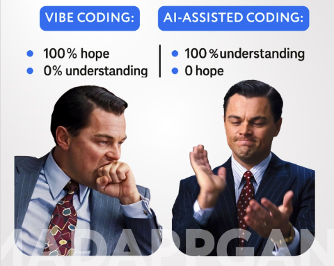

```{r, echo=FALSE, message=FALSE, warning=FALSE}
#| label: "setup"
#| include: false
knitr::opts_chunk$set(echo = TRUE)
library(readxl)
library(dplyr)
library(readr)
library(lessR)
library(ggplot2)
library(ggpubr)
library(ggpmisc)
library(ggbeeswarm)
library(broom)
library(cowplot)
library(patchwork)
library(palmerpenguins)
library(car)
library(ggforce) # for geom_circle
library(RVAideMemoire) #shapiro.test
library(DiagrammeR)
#knitr::opts_chunk$set(dpi= 100)
library(countdown)
library(knitr)
library(kableExtra)
```

## Key ethical considerations
1. Human Accountability / Responsabilidad humana
2. Intellectual Property and Licensing / Propiedad intelectual y licencias
3. Bias and Fairness / Sesgos y equidad
4. Security and Privacy / Seguridad y privacidad
5. Transparency and Explainability / Transparencia y explicabilidad
6. Impact on Developer Skills and Jobs / Impacto en habilidades y empleos de desarrolladores
7. ...

## Key ethical considerations

- [Proceedings of the Royal Society B](https://royalsociety.org/journals/ethics-policies/openness/)
- [Ecological Society of America](https://esa.org/publications/artificial-intelligence-ai-policy/)

##

```{r, echo=FALSE, fig.cap="", out.width = '45%'}
#| fig-align: center
knitr::include_graphics("figs/codeAI.png")
```


## What is Vibe Coding?

- [Vibe coding](https://en.wikipedia.org/wiki/Vibe_coding) is prompting an AI system to generate code based on natural language descriptions, saving you from writing it all from scratch.

- La codificación Vibe implica que un sistema de IA genere código basado en descripciones en lenguaje natural, lo que le ahorra tener que escribirlo todo desde cero.


##
<br><br>
```{r, echo=FALSE, fig.cap=""}
#| fig-align: center
knitr::include_graphics("figs/codeAI_1.gif")
```


## What is Vibe Coding?

-   Vibe coding, a term coined by [Andrej Karpathy](https://en.wikipedia.org/wiki/Andrej_Karpathy) in February 2025, describes an increasingly popular approach to writing software: express the code you want in a few sentences to an AI system like ChatGPT or Claude, then polish and (hopefully!) test the generated result.

-   Vibe coding, un término acuñado por [Andrej Karpathy](https://en.wikipedia.org/wiki/Andrej_Karpathy) en febrero de 2025, describe un enfoque cada vez más popular para escribir software: expresar el código que desea en unas pocas oraciones a un sistema de IA como ChatGPT o Claude, luego pulir y (¡con suerte!) probar el resultado generado.


## What is Vibe Coding?
- "... is the current phenomenon where someone, sometimes with zero programming experience, asks AI for a professional, complete solution, copies and pastes prompts, and keeps iterating without ever defining the internal logic until, miraculously, everything works." [^1] 

- ... es el fenómeno actual en el que alguien, a veces sin experiencia en programación, le pide a una IA una solución profesional y completa, copia y pega indicaciones y sigue iterando sin definir nunca la lógica interna hasta que, milagrosamente, todo funciona.

[^1]: [Link](https://www.reddit.com/r/vibecoding/comments/1m6lsdn/using_ai_as_a_coding_assistant_vibe_coding_if_you/.)


## What is Vibe Coding?
- The “product” is done. Did they understand how it works? Do they know why that line exists, or why that algorithm was used?[^1]

- El producto está listo. ¿Entendieron cómo funciona? ¿Saben por qué existe esa línea o por qué se usó ese algoritmo?

[^1]: [Link](https://www.reddit.com/r/vibecoding/comments/1m6lsdn/using_ai_as_a_coding_assistant_vibe_coding_if_you/.)

## What is Vibe Coding?
- Co-founder of openAI says of vibe coding: “It’s not really coding – I just see things, say things, run things, and copy-paste things, and it mostly works.”.[^1]

- El cofundador de openAI dice sobre la codificación vibratoria: "En realidad no es codificación: solo veo cosas, digo cosas, ejecuto cosas y copio y pego cosas, y en general funciona".

[^1]: [Link](https://www.businessinsider.com/vibe-coding-ai-silicon-valley-andrej-karpathy-2025-2)

## Coding Assistant ≠ Vibe Coding

## Coding Assistant ≠ Vibe Coding
<br>
```{r, echo=FALSE, out.width='50%', fig.align='center'}

```


## Coding Assistant ≠ Vibe Coding
- Using AI as a code assistant is **not the same** as what is now commonly called “vibe coding.” These are radically different ways of building solutions, and the difference matters a lot, especially when we talk about scalable and maintainable products in the long term.

- Usar la IA como asistente de código **no es lo mismo** que lo que ahora se conoce comúnmente como "Vibe Coding". Son formas radicalmente diferentes de crear soluciones, y la diferencia es fundamental, especialmente cuando hablamos de productos escalables y sostenibles a largo plazo.


## Coding Assistant
- You need to know how to code.

- Necesitas saber codificar.


## Coding Assistant
- It is not about handing everything over to the machine, but about **leveraging AI** to structure your ideas, polish your code, detect optimization opportunities, implement best practices, and, above all, understand what you are building and why. You are steering the conversation, setting the goal, designing algorithms so they are efficient, and making architectural decisions.[^1]

- No se trata de dejar todo en manos de la máquina, sino de **aprovechar la IA** para estructurar tus ideas, pulir tu código, detectar oportunidades de optimización, implementar las mejores prácticas y, sobre todo, comprender qué estás construyendo y por qué. Estás dirigiendo la conversación, estableciendo el objetivo, diseñando algoritmos eficientes y tomando decisiones arquitectónicas.

[^1]: [Link](https://www.reddit.com/r/vibecoding/comments/1m6lsdn/using_ai_as_a_coding_assistant_vibe_coding_if_you/.)

## Coding Assistant
- You use AI as a tool to implement each part faster and in a more robust way. 

- Utiliza la IA como herramienta para implementar cada parte de forma más rápida y robusta.

## How to use AI agents safely

## How to use AI agents safely
:::: {.columns}
::: {.column width="50%"}
- AI agents are still very useful. But for scientific coding they need careful oversight. You can either:
    1) Let it run autonomously, then carefully go back through what its created and review everything 
    2) Check and review it step-by-step, and redirect it
:::
::: {.column width="50%"}
- Los agentes de IA siguen siendo muy útiles. Sin embargo, para la codificación científica, requieren una supervisión minuciosa. Puedes:
    1) Dejar que se ejecute de forma autónoma, revisar cuidadosamente lo creado y revisarlo todo. 
    2) Revisarlo paso a paso y redirigirlo.
:::
::::

## How to use AI agents safely
- Remember that the commercial agents, like Claude code or github copilot, are designed for software engineers. So they write **robust R code**, but they are also not very good at statistics.[^1]

- Recuerda que los agentes comerciales, como Claude Code o GitHub Copilot, están diseñados para ingenieros de software. Por lo tanto, escriben código R robusto, pero tampoco son muy buenos en estadística

[^1]: [Link](https://www.r-bloggers.com/2025/06/vibe-coding-with-ai-agents-is-not-for-scientists/)

## Robust code?
- “Robust code” usually means code that keeps working correctly even when conditions aren’t ideal. In other words, it doesn’t break easily, it handles unexpected inputs gracefully, and it avoids hidden assumptions that cause errors later.

- El término “código robusto” generalmente se refiere a código que sigue funcionando correctamente incluso cuando las condiciones no son ideales. En otras palabras, no se rompe fácilmente, maneja entradas inesperadas de manera adecuada y evita asumir cosas ocultas que puedan causar errores más adelante.

## Robust code?: Example
- Non-robust code
```{r eval=F}
mean(df$value)
```
- If `df$value` has NA values → returns NA (silent failure).
- Si `df$value` tiene valores NA → devuelve NA sin advertir el problema.

## Robust code?: Example
- Robust code  
```{r eval=F}
# Check if the column 'value' exists in the data frame
if (!"value" %in% names(df))
  # Stop execution and show an informative error message
  stop("Column 'value' not found in data frame.")
# Calculate the mean while removing NA values to avoid a silent NA result
mean(df$value, na.rm = TRUE)
```
- Checks that the column exists.
- Verifica que la columna exista.

- Handles NA values safely.
- Maneja valores NA de forma segura.

## Why does this matter?
- Non-robust code can hide problems in your data. When the code silently returns NA or assumes everything is correct, you may base your scientific conclusions on mistakes you never noticed. Robust code makes those problems visible early, so your analysis is more reliable and reproducible.

- El código no robusto puede ocultar problemas en tus datos. Cuando el código devuelve NA sin avisar o asume que todo está bien, puedes basar tus conclusiones científicas en errores que nunca viste. El código robusto hace que esos problemas aparezcan desde el inicio, haciendo tu análisis más confiable y reproducible.

## Recommendations for responsible use
- Given the promise and peril of vibe coding, it is imperative to approach it with a framework of caution and responsibility. Here are several recommendations to guide ethical development:

- Dadas las promesas y los riesgos de la codificación de vibraciones, es imperativo abordarla con cautela y responsabilidad. A continuación, se presentan varias recomendaciones para guiar el desarrollo ético:

## Recommendations for responsible use
(@) Match Method to Mission: Use vibe coding selectively. For experimental, low-stakes projects, it can be a helpful prototyping tool. But for anything involving personal data, security, or human well-being, manual oversight and traditional coding methods must remain central.

1) Adaptar el método a la misión: Utilizar la vibe coding de forma selectiva. Para proyectos experimentales de bajo riesgo, puede ser una herramienta útil para la creación de prototipos. Sin embargo, para cualquier proyecto que involucre datos personales, seguridad o bienestar humano, la supervisión manual y los métodos de codificación tradicionales deben seguir siendo fundamentales.

## Recommendations for responsible use
(@) Ensure Human Oversight: Every output generated by AI should be reviewed by someone with domain expertise. Whether you’re deploying a chatbot or a health tracker, humans must remain the final authority — not the AI.

2. Garantizar la supervisión humana: Todo resultado generado por la IA debe ser revisado por alguien con experiencia en la materia. Ya sea que se implemente un chatbot o un monitor de salud, la autoridad final debe ser la humana, no la IA. 

## Recommendations for responsible use
(@) Understand AI Limitations: Developers should educate themselves on the limitations of large language models (LLMs), including hallucinations, context limitations, and training data cutoff issues.

3. Comprender las limitaciones de la IA: Los desarrolladores deben informarse sobre las limitaciones de los grandes modelos de lenguaje (LLM), incluyendo alucinaciones, limitaciones de contexto y problemas de corte en los datos de entrenamiento.

## Recommendations for responsible use
(@) Balance AI with Domain-Specific Knowledge: If the project intersects with psychology, medicine, education, or public safety, developers should involve experts from those domains. AI cannot account for cultural nuance, psychological impact, or ethical dilemmas the way a trained human can.

4. Equilibrar la IA con el conocimiento específico del dominio: Si el proyecto se relaciona con la psicología, la medicina, la educación o la seguridad pública, los desarrolladores deben involucrar a expertos de esos dominios. La IA no puede considerar los matices culturales, el impacto psicológico ni los dilemas éticos como lo hace un humano capacitado.

## Recommendations for responsible use
(@) Push for Transparency in Tools: AI coding tools should provide traceability, showing where code suggestions originated and flagging when patterns might be derived from unreliable or AI-generated sources.

5. Impulsar la transparencia en las herramientas: Las herramientas de codificación de IA deben proporcionar trazabilidad, mostrando el origen de las sugerencias de código y señalando cuándo los patrones podrían derivarse de fuentes poco fiables o generadas por IA.


## 



## AI agents
- ChatGPT
- [Claude](https://www.anthropic.com/index/claude-3)
- [RTutor](https://rtutor.ai/)
- [Gemini](https://gemini.google/)
- [Perplexity](https://www.perplexity.ai/)
- [Github Copilot](https://docs.github.com/en/copilot/how-tos/set-up/set-up-for-self)
- ...

## Example: ANOVA


## Example: ANOVA
```{r, warning=FALSE}
data <- read.csv("data/chap15q31singingMice.csv")
head(data)
```


## Example: ANOVA
```{r, echo=TRUE, message=FALSE, warning=FALSE, fig.width=5, fig.height=4.5}
#| output-location: column
#| fig-align: center
p <- ggplot(data, aes(x = songType, y = NsongsPre, fill = songType)) +
  geom_boxplot(alpha = 0.7) +
  geom_jitter(width = 0.1, size = 3) +
  theme_minimal(base_size = 14) +
  labs(
    x = "Treatment",
    y = "Songs (Post – Pre)",
    title = "Song Response by Treatment"
  ) +
  theme(legend.position = "none")
p
```


## Example ANOVA
```{r}
anova <- aov(NsongsPre ~ songType, data = data)
summary(anova)
```

## 
```{r}
# Assuming 'anova_model' is defined from your previous code
# Extract residuals
residuals_anova <- residuals(anova)
# Q-Q plot for visual assessment
qqnorm(residuals_anova)
qqline(residuals_anova, col = "red")
```


## Normality test
```{r}
# Shapiro-Wilk test for normality
shapiro_result <- shapiro.test(residuals_anova)
print(shapiro_result)
```


