```{r, echo=FALSE, message=FALSE, warning=FALSE}
library(readxl)
library(dplyr)
library(readr)
library(lessR)
library(ggplot2)
library(ggpubr)
library(cowplot)
library(patchwork)
library(palmerpenguins)
library(car)
library(ggforce) # for geom_circle
library(RVAideMemoire) #shapiro.test
library(DiagrammeR)
#knitr::opts_chunk$set(dpi= 100)
xaringanExtra::use_panelset()
xaringanExtra::use_scribble()
xaringanExtra::use_search(show_icon = FALSE, position= "bottom-left") # Search
xaringanExtra::use_progress_bar(color = "#0051BA", location = "bottom", 
                                height = "4px")
xaringanExtra::use_clipboard() # Copy Code 
xaringanExtra::use_extra_styles(
  hover_code_line = TRUE,         #<<
  mute_unhighlighted_code = TRUE  #<<
)
xaringanExtra::use_editable(expires = 1) # Add textboxes to edit during presentation
```


this is cool 
<br><br><br>
<center>
```{r, echo=FALSE, fig.cap="", out.width = '50%'}
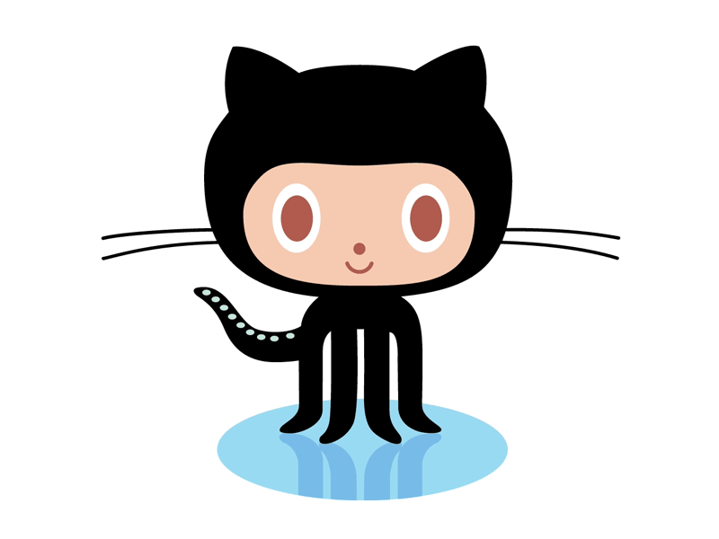
```
<center>

---
exclude: true

https://happygitwithr.com/

---
# Flowchart
- Send your Rtutorial throught your personal website.
- You can use the following flowchart to understand the process of creating your personal website and connecting it to GitHub.
- The flowchart illustrates the steps from creating a GitHub account to pushing changes from RStudio to your GitHub repository.

---
# Flowchart
- Before, defining concepts:
<br><br> <!-- adds vertical space -->
    - **Git:** A version control system that allows you to track changes in your code and collaborate with others.
    - `r fontawesome::fa("github", a11y = "sem")` **GitHub:** A web-based platform that uses Git for version control and collaboration, allowing you to host your code repositories online. Other similar platforms include GitLab and Bitbucket.
        - `r fontawesome::fa("github", a11y = "sem")` GitHub is like a social network for developers, where you can share your code, collaborate with others, and showcase your projects.
    
---
# Flowchart
- Steps to create a personal website using R Markdown and GitHub:
    1. **Create a GitHub account:** Sign up for a free account on GitHub to host your code repositories.
    2. **Create a project in RStudio:** Open RStudio and create a new project that will be linked to your GitHub repository.
    3. **Push changes to GitHub:** After making changes to your project in RStudio, you can push those changes to your GitHub repository to keep it updated.
    
---
# Flowchart
- The flowchart below shows the basic steps to create a personal website using R Markdown and GitHub.

<center>
```{r, echo=FALSE, out.width = '20%'}
grViz("
digraph flowchart {
  graph [rankdir = TB]

  node [shape = rectangle, style=filled, fillcolor=lightblue]
  
  A [label = 'My webpages']
  B [label = 'GitHub' ]
  C [label = 'RStudio']

  A -> B
  A -> C
  
}
")


```
</center>

---

# Flowchart

<center>
```{r, echo=FALSE, out.width = '50%'}
grViz("
digraph flowchart {
  graph [rankdir = TB]

  node [shape = rectangle, style=filled, fillcolor=lightblue]
  
  A [label = 'My webpages']
  B [label = 'Github', fillcolor = lightblue]
  C [label = 'RStudio', fillcolor = white]
  
  D [label = 'Github Account']
  E [label = 'Create repository']
  F [label = 'Clone repository']
  
  G [label = 'Create project', fillcolor = white]

  A -> B
  A -> C
  
  B -> D
  D -> E
  E -> F 
  
  C -> G [label = 'url from Clone repository'] 

}
")


```
</center>


---
# Flowchart

<center>
```{r, echo=FALSE, out.width = '50%'}
grViz("
digraph flowchart {
  graph [rankdir = TB]

  node [shape = rectangle, style=filled, fillcolor=lightblue]
  
  A [label = 'My webpages']
  B [label = 'Github']
  C [label = 'RStudio']
  
  D [label = 'Github Account', fillcolor = white]
  E [label = 'Create repository', fillcolor = white]
  F [label = 'Clone repository', fillcolor = white]
  
  G [label = 'Create project']
  H [label = 'Save project']
  I [label = 'Your new project is ready!']

  A -> B
  A -> C
  
  B -> D
  D -> E
  E -> F 
  
  C -> G [label = 'url from Clone repository'] 
  G -> H
  H -> I

  // Flecha curva externa
  I:w -> B:w [label = 'Push changes', constraint = false, color = gray, style = dashed, minlen=4]
}
")


```
</center>

---
# Create an account in GitHub

---
# Create an account in GitHub
.pull-left[
- Create and account in .link-style2[[GitHub](https://github.com/)]
]

.pull-right[
<br><br><br> <!-- adds vertical space -->
```{r, echo=FALSE, fig.cap="", out.width = '120%'}
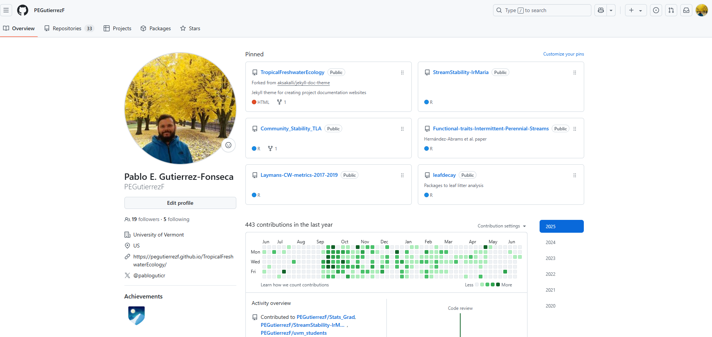
```
]


---
# Create a repository
.pull-left[
- Create a `Repository` for this course.
    - `New`
    - Create a new repository
    - add a name
    - Click `public`
    - `Add a README file`
    - Add a .gitignore file
        - `R`
    - Add a license
        - `MIT`
    - Click `Create repository`
    - Add a description (optional)
]

.pull-right[
]


---
# Create a repository
.pull-left[
- Create a `Repository` for this course.
    - `New`
    - Create a new repository
    - add a name
    - Click `public`
    - `Add a README file`
    - Add a .gitignore file
        - `R`
    - Add a license
        - `MIT`
    - Click `Create repository`
    - Add a description (optional)
]

.pull-right[
<br><br><br> <!-- adds vertical space -->
```{r, echo=FALSE, fig.cap="", out.width = '90%'}
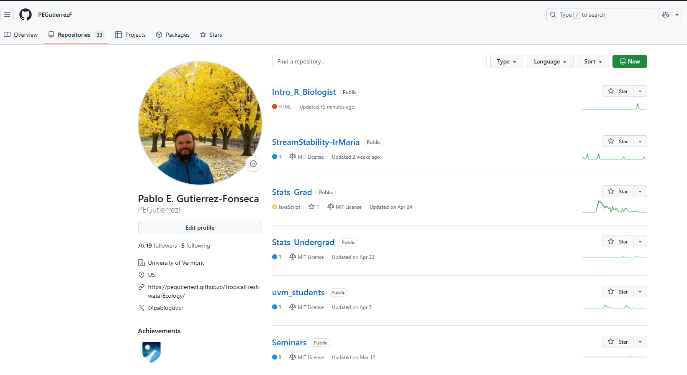
```
]

---
# Create a repository
.pull-left[
- Create a `Repository` for this course.
    - `New`
    - Create a new repository
    - add a name
    - Click `public`
    - `Add a README file`
    - Add a .gitignore file
        - `R`
    - Add a license
        - `MIT`
    - Click `Create repository`
    - Add a description (optional)
]

.pull-right[
```{r, echo=FALSE, fig.cap="", out.width = '90%'}
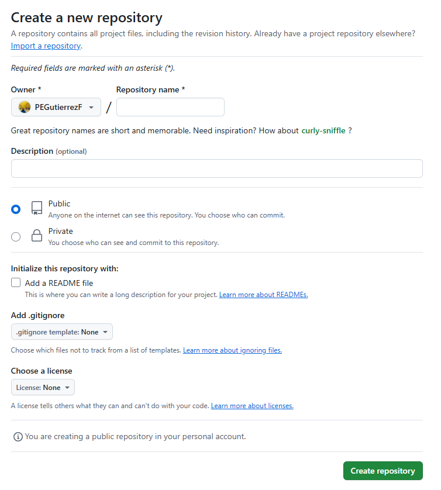
```
]


---
# Clone the repository

.pull-left[
- Clone the repository to your computer
    - Click on `Code`
    - Copy the URL

]

.pull-right[
<br><br><br> <!-- adds vertical space -->
```{r, echo=FALSE, fig.cap="", out.width = '90%'}
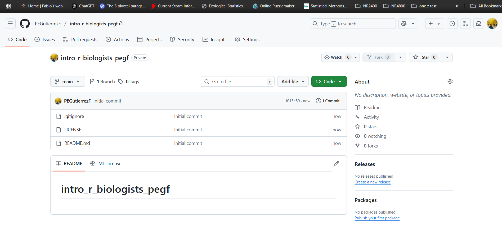
```
]

---
# Clone the repository

.pull-left[
- Clone the repository to your computer
    - Click on `Code`
    - Copy the URL

]

.pull-right[
<br><br><br> <!-- adds vertical space -->
```{r, echo=FALSE, fig.cap="", out.width = '90%'}
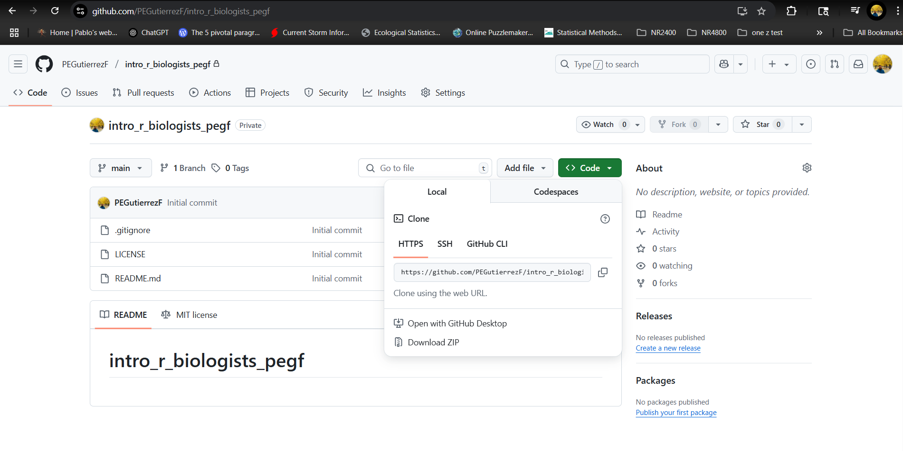
```
]


---
# Flowchart

<center>
```{r, echo=FALSE, out.width = '50%'}
grViz("
digraph flowchart {
  graph [rankdir = TB]

  node [shape = rectangle, style=filled, fillcolor=lightblue]
  
  A [label = 'My webpages']
  B [label = 'Github', fillcolor = white]
  C [label = 'RStudio']
  
  D [label = 'Github Account', fillcolor = white]
  E [label = 'Create repository', fillcolor = white]
  F [label = 'Clone repository', fillcolor = white]
  
  G [label = 'Create project']
  H [label = 'Save project']
  I [label = 'Your new project is ready!']

  A -> B
  A -> C
  
  B -> D
  D -> E
  E -> F 
  
  C -> G [label = 'url from Clone repository'] 
  G -> H
  H -> I

  // Flecha curva externa
  I:w -> B:w [label = 'Push changes', constraint = false, color = gray, style = dashed, minlen=4]
}
")


```
</center>

---
# Create a project in RStudio in your computer

1. Open RStudio on your computer.
2. In the top menu, go to `File` > `New Project....`
3. A window will pop up. Select the option:
    - `Version Control` > `Git`.
4. Paste the Git repository URL in the provided field.
5. Choose the directory where you'd like to store your project.
6. Click `Create Project` to initialize your RStudio project connected to Git.

---
# Create a RMarkdown for your personal website
**Step 1:** Create a new R Markdown file
.pull-left[
1. Open RStudio on your computer.
2. In the top menu, go to `File` > `New File....`
3. A window will pop up. Select the option:
    - `R Markdown`
4. A new window will pop up. 
    - Add titile
    - Default output format
        - Select `HTML`
    - Click `OK`
]

.pull-right[
<br><br><br> <!-- adds vertical space -->
```{r, echo=FALSE, fig.cap="", out.width = '120%'}
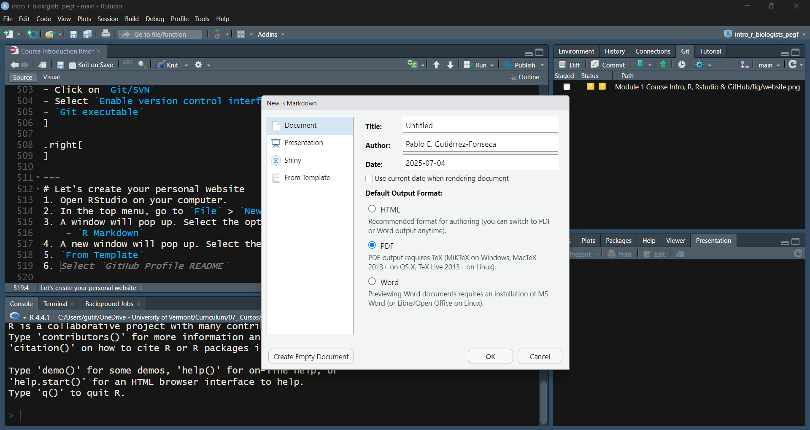
```

]


---
# Create a RMarkdown for your personal website
**Step 2:** Create a new R Markdown file
.pull-left[
1. Open RStudio on your computer.
2. In the top menu, go to `File` > `New File....`
3. A window will pop up. Select the option:
    - `R Markdown`
4. A new window will pop up. 
    - Add titile
    - Default output format
        - Select `HTML`
    - Click `OK`
]

.pull-right[
- Now you have a new R Markdown file with the following template code:
<br><br><br> <!-- adds vertical space -->
```{r, echo=FALSE, fig.cap="", out.width = '120%'}
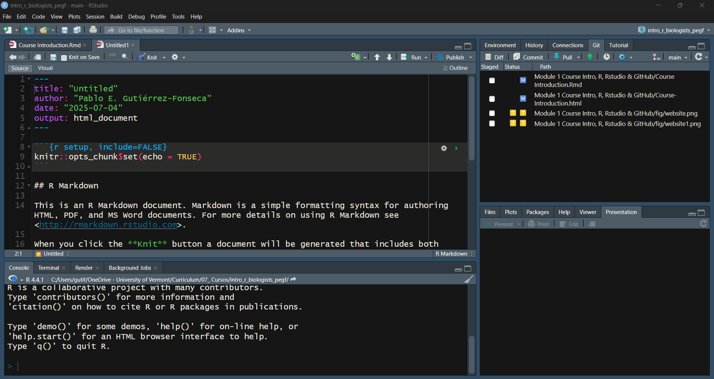
```
]

---
# Create a RMarkdown for your personal website
**Step 3:** Edit the R Markdown file
.pull-left[
1. Change the title to your name and surname.
2. Change the subtitle to your current position (e.g., PhD student, Postdoc, etc.).
3. Change the author to your name and surname.
4. Change the date to the current date.
5. Output:
    Add the following lines:
        prettydoc:html_pretty
            theme = cayman
            highlight = github
]

.pull-right[
- **Note:** Indentation and spacing are important in YAML headers.
<br><br><br> <!-- adds vertical space -->
```{r, echo=FALSE, fig.cap="", out.width = '120%'}
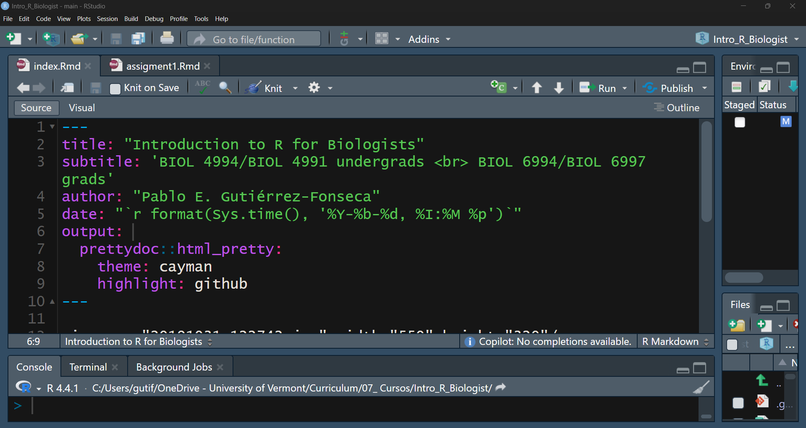
```
]

---
# Create a RMarkdown for your personal website
**Step 4:** Knit the R Markdown file to create the HTML file
.pull-left[
1. Save the file as `index.Rmd` in your project folder.
2. In the top menu, go to `File` > `Save As...`
3. A window will pop up. 
    - Select the project folder you created.
    - Name the file `index.Rmd`.
    - Click `Save`.
4. In the top menu, go to `File` > `Knit Document`.
5. A new HTML file will be created in your project folder with the name `index.html`.
]

.pull-right[
]

---
# Create a RMarkdown for your personal website
**Step 4:** Knit the R Markdown file to create the HTML file
.pull-left[
1. Save the file as `index.Rmd` in your project folder.  
2. In the top menu, go to `File` > `Save As...`  
3. A window will pop up.  
    - Select the project folder you created.  
    - Name the file `index.Rmd`.  
    - Click `Save`.  
4. In the top menu, go to `File` > `Knit Document`.  
5. A new HTML file will be created in your project folder with the name `index.html`.  
]

.pull-right[
<ol start="6">
<li>After knitting, you should see the index.html file in your project folder.</li>
<li>Make sure both index.Rmd and index.html files are the only files in your project folder.</li>
</ol>
]


---
# Flowchart

<center>
```{r, echo=FALSE, out.width = '50%'}
grViz("
digraph flowchart {
  graph [rankdir = TB]

  node [shape = rectangle, style=filled, fillcolor=lightblue]
  
  A [label = 'My webpages']
  B [label = 'Github']
  C [label = 'RStudio', fillcolor = white]
  
  D [label = 'Github Account', fillcolor = white]
  E [label = 'Create repository', fillcolor = white]
  F [label = 'Clone repository', fillcolor = white]
  
  G [label = 'Create project', fillcolor = white]
  H [label = 'Save project', fillcolor = white]
  I [label = 'Your new project is ready!']

  A -> B
  A -> C
  
  B -> D
  D -> E
  E -> F 
  
  C -> G [label = 'url from Clone repository'] 
  G -> H
  H -> I

  // Flecha curva externa
  I:w -> B:w [label = 'Push changes', constraint = false, color = red, style = dashed, minlen=4]
}
")


```
</center>

---
# Connect your project to GitHub

---
# Connect your project to GitHub
1. To connect your RStudio project to GitHub, you need to enable the version control interface in RStudio and set up Git.
  - Download and install Git on your computer if you haven't done so already. You can download it from the official Git website: https://git-scm.com/downloads.

---
# Connect your project to GitHub
2. Open RStudio on your computer.
- Go to `Tools`
- Click `Global options..`
- Click on `Git/SVN`
- Select `Enable version control interface for RStudio projects`
- Select `Git executable`
  - Select the path to the `Git` on your computer.
        - `C:\Program Files\Git\bin\git.exe)`
  - If you installed Git via Homebrew, the path will be:
        - `/usr/local/bin/git`
- Click `OK`
- **Restart RStudio**

---
#Connect your project to GitHub (using Git Bash)
- Open Git Bash (installed with Git).
- Run:
    - `which git`
- This shows the path to the Git executable on your computer. 
    - For example, it might be something like:
        - `C:\Program Files\Git\bin\git.exe` (on Windows)
        - `/usr/local/bin/git` (on Mac if installed via Homebrew)
- Copy this path and paste it in RStudio:
`Tools → Global Options → Git/SVN → Git executable`
- Click `OK` and **Restart RStudio**.

- **Note: Both procedures are equivalent — the goal is just to tell RStudio where Git is installed.**

---
# Next is tell to Git who you are  (step 1)
1. Open `Terminal (not RStudio)` and run these commands:

```markdown
# Set your name (this will appear in your commits)
git config --global user.name "Tu Nombre"

# Set your email (must match your GitHub account email)
git config --global user.email "tucorreo@example.com"
```

---
# Next is tell to Git who you are (step 2)
1. Open `Terminal (not RStudio)` and run these commands:

```markdown
# Set your name (this will appear in your commits)
git config --global user.name "Tu Nombre"

# Set your email (must match your GitHub account email)
git config --global user.email "tucorreo@example.com"
```
<center>
```{r, echo=FALSE, fig.cap="", out.width = '40%'}
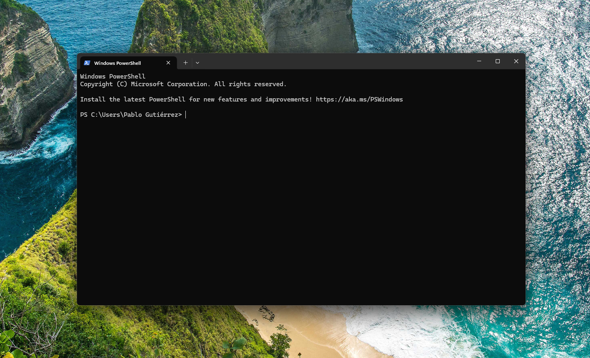
```
</center>

---
# Next is tell to Git who you are  (step 2.1)
- How to open **Terminal** on your computer:
    - **On Mac:**
        - Press Command (⌘) + Space to open Spotlight Search, type Terminal, and press Enter.
        - Or go to Applications → Utilities → Terminal.
    - **On Windows:**
        - Open the Start Menu, type Git Bash (installed with Git), and press Enter.
    
    
---
# Next is tell to Git who you are  (step 3)
- Still in **Terminal**, check that Git saved your info: 
```{r, eval=FALSE}
git config --global --list
```

- You should see your name and email listed.
```{r, eval=FALSE}
user.name= Tu Nombre
user.email= tucorreo@example.com
```

---
# Push your changes to GitHub
- In RStudio, go to the `Git` tab in the top right panel.
- You should see the files listed.
- Check the boxes next to the files you want to commit.
- Write a commit message in the `Commit message` box (e.g., "Initial commit").
- Click the `Commit` button to commit your changes.
- Click the `Push` button to push your changes to GitHub.
- Your changes should now be live on GitHub!
- but...


---
# If you get an error 403…

<center>
```{r, echo=FALSE, fig.cap="", out.width = '25%'}
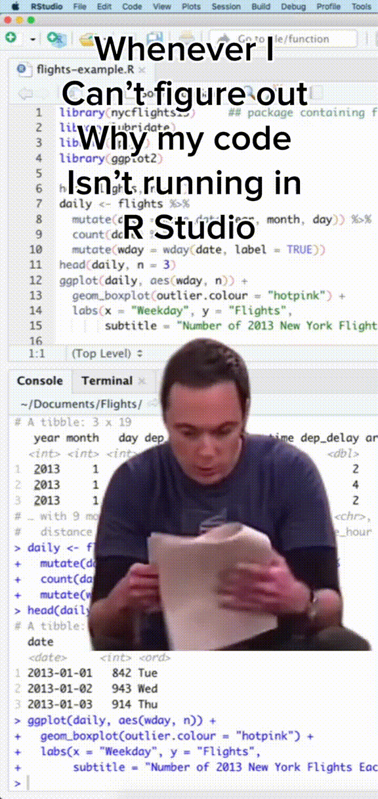
```
<center>

---
# If you get an error 403…
- This error happens when trying to push to GitHub with incorrect authentication.

- GitHub **no longer accepts account passwords for HTTPS connections.**

- Instead, you must use a **Personal Access Token (PAT).**
    

---
# If you get an error 403…
- This usually happens because GitHub no longer accepts passwords for HTTPS connections. Instead, you need to use a **Personal Access Token (PAT)**.
<br>
- To create a PAT:
  1. Go to your GitHub account `settings`.
  2. Click on `Developer settings` > `Personal access tokens` > `Tokens (classic)`.
  3. Click on `Generate new token`.
  4. Select the scopes you need (for basic usage, you can select `repo` and `read:user`).
  5. Click `Generate token`.
  6. Copy the generated token and store it securely (you won't be able to see it again).

---
# If you get an error 403…
- When prompted for your password during Git operations, use the **PAT (Personal Access Token)** instead of your GitHub password.

- Use your **GitHub username** when asked for the username.

---
# Let's create your personal website


---
# Let's create your personal website 
**Step 1:** Push your index.Rmd and index.html files to GitHub

.pull-left[
1. **In RStudio**, go to the `Git` tab in the top right panel.
2. You should see the `index.Rmd` and `index.html` files listed.
3. Check the boxes next to the files you want to commit.
4. Write a commit message in the `Commit message` box (e.g., "Initial commit of personal website").
5. Click the `Commit` button to commit your changes.
]

.pull-right[
<ol start="6">
  <li> Click the Push button to push your changes to GitHub.</li>
  <li> Your personal website is now live on GitHub!</li>
  <li> You can share the link to your personal website with others.</li>
  <li> You can continue to edit and update your personal website by modifying the index.Rmd file and pushing the changes to GitHub.</li>
</ol>
]

---
# Let's create your personal website 
**Step 2:** Visit your personal website
.pull-left[
1. Open your web browser and go to your **GitHub repository**.
2. Click on the `Settings` tab in your repository.
3. Scroll down to the `Pages` section.
4. Under `Your site is live at`, you will see 'Visit site` button.
5. Make sure the source is set to `main` branch and `/ (root)`.
    - Wait until you see this message: "Your site is ready to be published at ..."
 
]

.pull-right[
<br> <!-- adds vertical space -->
```{r, echo=FALSE, fig.cap="", out.width = '120%'}
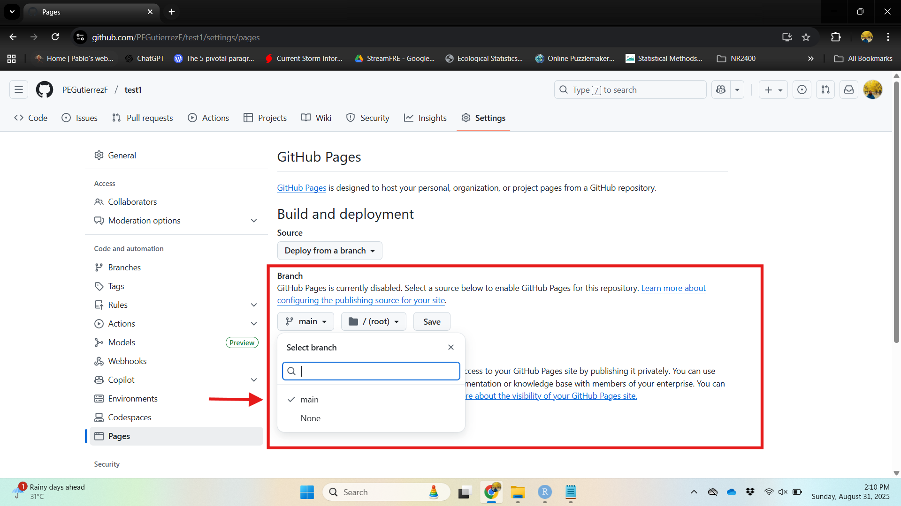
```
]

---
# Let's create your personal website 
**Step 2:** Visit your personal website
.pull-left[
1. Open your web browser and go to your **GitHub repository**.
2. Click on the `Settings` tab in your repository.
3. Scroll down to the `Pages` section.
4. Under `Your site is live at`, you will see 'Visit site` button.
5. Make sure the source is set to `main` branch and `/ (root)`.
6. Click on the `Visit site` button to open your personal website.
]

.pull-right[
<br> <!-- adds vertical space -->
```{r, echo=FALSE, fig.cap="", out.width = '120%'}
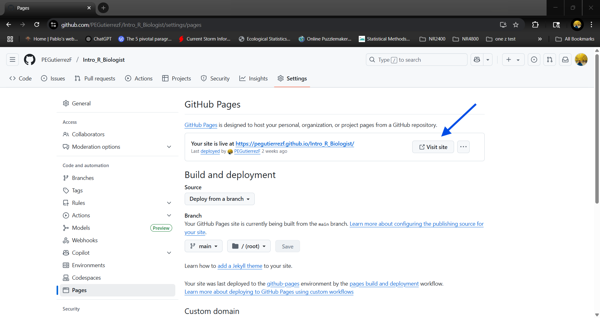
```
]

---
# Edit your `index.Rmd` file
.pull-left[
1. Open the `index.Rmd` file in RStudio.
2. Add a new section with your name and a brief introduction about yourself.
3. You can use Markdown syntax to format your text, add headings, lists, links, and images.
  - Save an image in your folder and use the following syntax to add it:
    ```markdown
    
    ```
]
.pull-right[
<br> <!-- adds vertical space -->
```{r, echo=FALSE, fig.cap="", out.width = '120%'}
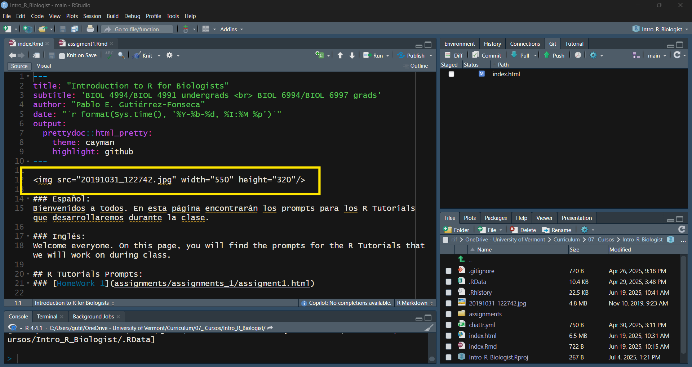
```
]

---
# Include Rtutorials in your personal website
**Step 1:** Create a Markdown file for each homework assignment.
.pull-left[
1. In RStudio, go to `File` > `New File` > `R Markdown`.
2. Name the file `assignment1.Rmd`, `assignment2.Rmd`, etc.
3. Add the YAML header at the top of the file:
    - `title: "Assignment 1"`
    - `author: "Your Name"`
    - `date: "``"`
4. Add the content of the assignment in Markdown format.
5. Save the file in your project folder.
6. Knit the file to create the HTML file.
]
.pull-right[
<br><br> <!-- adds vertical space -->
```{r, echo=FALSE, fig.cap="", out.width = '120%'}
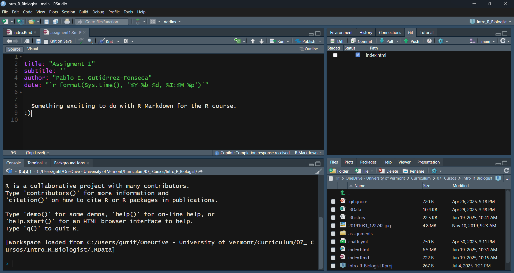
```
]

---
# Include Rtutorials in your personal website
**Step 2:** Add a link to the assignment in the `index.Rmd` file.
.pull-left[
1. Open the `index.Rmd` file in RStudio.
2. Add a new section for the assignments.
3. Use the following syntax to add a link to the assignment:
```markdown
R Tutorials Prompts:
[HomeWork 1](assignments/assignments_1/assigment1.html)
```
4. knit the `index.Rmd` file to update the personal website.
]
.pull-right[
<br> <!-- adds vertical space -->
```{r, echo=FALSE, fig.cap="", out.width = '120%'}
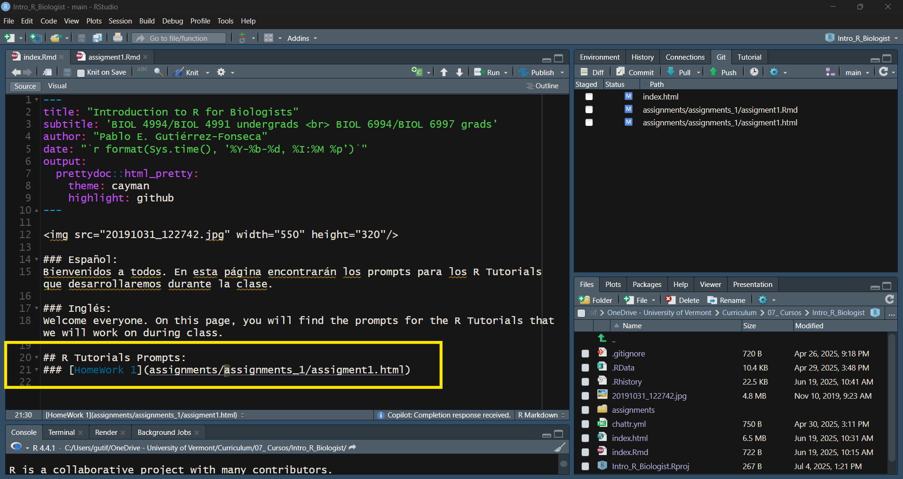
```
]
