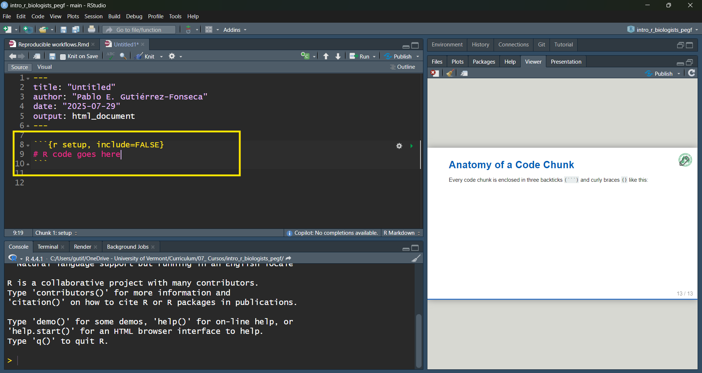
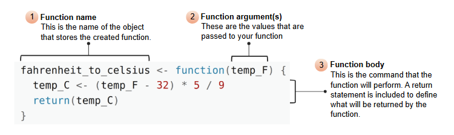

```{r, echo=FALSE, message=FALSE, warning=FALSE}
library(readxl)
library(dplyr)
library(readr)
library(lessR)
library(ggplot2)
library(ggpubr)
library(cowplot)
library(patchwork)
library(palmerpenguins)
library(car)
library(ggforce) # for geom_circle
library(RVAideMemoire) #shapiro.test
library(DiagrammeR)
#knitr::opts_chunk$set(dpi= 100)
xaringanExtra::use_panelset()
xaringanExtra::use_scribble()
xaringanExtra::use_search(show_icon = FALSE, position= "bottom-left") # Search
xaringanExtra::use_progress_bar(color = "#0051BA", location = "bottom", 
                                height = "4px")
xaringanExtra::use_clipboard() # Copy Code 
xaringanExtra::use_extra_styles(
  hover_code_line = TRUE,         #<<
  mute_unhighlighted_code = TRUE  #<<
)
xaringanExtra::use_editable(expires = 1) # Add textboxes to edit during presentation
```


# What we just covered
- We looked at the YAML header, the part at the top of every .Rmd file. You now know:
- It's where you define things like title, author, date, output format, etc.
- It looks like this:

```{r eval=FALSE}
---
title: "Untitled"
author: "name"
date: "`r format(Sys.time(), '%Y-%b-%d, %I:%M %p')`"
output: html_document
---
```


---
# The Three Main Elements of R Markdown
There are three essential components in any `.Rmd` file:
1. YAML header (you've seen this)
2. Markdown text, where you write your narrative
3. Code chunks, where your R code lives and runs

---
# Code Chunks in R Markdown
- Code chunks are the engine of your R Markdown document. They are where all your R code runs, generating figures, tables, summaries, models, and more. 

---
# Anatomy of a code chunk
Every code chunk is enclosed in three backticks `(```)` and curly braces `{}` like this:

<center>
```{r, echo=FALSE, fig.cap="", out.width = '60%'}

```
<center>

- It is inside the `{}` that you define how the chunk behaves — whether the code runs, whether it’s shown, and whether the output is displayed.


---
# Code chunk options

| Option                           | What it does                                      |
|----------------------------------|---------------------------------------------------|
| `eval = FALSE`                   | Don't run the code at all                         |
| `echo = FALSE`                   | Run the code, but don’t show the code             |
| `include = FALSE`               | Run the code but don’t show code **or** output    |
| `message = FALSE`, `warning = FALSE` | Suppress messages and warnings from the output |

---
# Knitting
- Knitting is the process of converting your `.Rmd` file into a final document, like HTML, PDF, or Word.

---
# New content starts here

---
# How cite R?
```{r}
citation()
```

---
# Install packages
- Packages are collections of R functions, data, and compiled code that extend R's capabilities.

- You only need to install packages once per R installation.

```{r}
install.packages("dplyr") # dplyr for data manipulation
install.packages("ggplot2") # ggplot2 for data visualization
# install.packages(c("dplyr", "ggplot2")) # Install multiple packages at once
```

---
# Load packages
- After installing a package, you need to load it into your R session every time you start R.
- This is done using the `library()` function.

```{r}
library(dplyr) # Load dplyr for data manipulation
library(ggplot2) # Load ggplot2 for data visualization
```

---
# Cite specific packages?
```{r}
citation("dplyr")
```

---
# Cite specific packages?
```{r}
citation("ggplot2")
```

---
# Help in R
- R has extensive built-in help files for functions and packages.
- You can access help using the `?` operator or the `help()` function.

```{r, eval=FALSE}
?lm # Help for the lm() function
```

---
# Atomic elements of R
- **Atomic vectors** are the most basic data structures in R. They can hold elements of a single type (e.g., all numeric, all character, etc.).

- The most basic data types in R are:
  - Numeric: Numbers (e.g., 1, 2.5, -3)
  - Character: Text strings (e.g., "Hello", "R is fun")
  - Logical: Boolean values (TRUE or FALSE)
  - Integer: Whole numbers (e.g., 1L, 2L)
  - Complex: Complex numbers (e.g., 1+2i)
  
---
# Symbols in R
- `<-` : Assignment operator, used to assign values to variables. (`Alt + -` or `Option + -` to insert)
- `#` : Comment symbol, used to add comments in the code.
- `==` : Equality operator, used to compare two values.
- `=` : Assignment operator, can also be used to assign values to variables (less common in R).
- `+, -, *, /` : Arithmetic operators for addition, subtraction, multiplication, and division.
- `>, <, >=, <=` : Relational operators for comparisons.
- `&` : Logical AND operator.
- `~` : model formula operator, used in statistical modeling.
- `$` : Used to access elements of a list or data frame.
- `:` : Sequence operator, used to create sequences of numbers.
- `c()` : Combine function, used to create vectors. 
- `()` : Parentheses, used to group expressions and control order of operations.


---
# Objects in R
- At the heart of almost everything you will do (or ever likely to do) in R is the concept that everything in R is an object. 

- These objects can be almost anything, from a single number or character string (like a word) to highly complex structures like the output of a plot, a summary of your statistical analysis or a set of R commands that perform a specific task. 
- Understanding how you create objects and assign values to objects is key to understanding R.

---
# Creating objects in R

- You create an object in R by assigning a value to a name using the assignment operator `<-` (or `=`).
- Shortcuts: Alt + - (Windows) or Option + - (Mac) to insert `<-`.
```{r}
my_obj <- 48
my_obj
```

--

```{r}
48 -> my_obj1
my_obj1

```

---
# Creating objects in R
```{r}
my_obj2 <- "R is cool"
my_obj2
```

---
# Data set

---
# Data set
- Load the data into memory
```{r}
data(penguins)
```

--

<br>

- Specify the data vector for body mass
```{r}
penguins$body_mass
```

---
# Data set

- Specify the entire second column in the data table
```{r}
penguins[,2]
```

---
# Data set

- Specify the 15th row of the first column in the data table
```{r}
penguins[15,1]
```

---
# Data set

- Specify the second to 10th row of the first column as a vector
```{r}
penguins[2:10,1]
```

---
# Data set
- Specify the second to fifteenth elements of the island vector
```{r}
penguins$island[2:15]
```

---
# Individual summary statistics

---
# Individual summary statistics

- Numerical variables
```{r}
mean(penguins$body_mass_g, na.rm = TRUE)
median(penguins$body_mass_g, na.rm = TRUE)
```


---
# Individual summary statistics

- Categorical variable
  - Counts of observations in each category
```{r}
table(penguins$island)
```


---
# Individual summary statistics

- Categorical variable
  - Proportions of observations in each category
```{r}
prop.table(table(penguins$island))
```

---
# Sets of statistics

--
- Base R functions
```{r}
summary(penguins)
```

---
# Sets of statistics

- Base R functions
```{r}
summary(penguins$body_mass_g)

```

---
# R Functions


---
# R Functions
- You can write your own functions to perform repetitive operations using a single command.

- A function has three main components:

```{r}
my_function <- function(input) {
  Body
  return(output)
}
```

- Function name: The name you will use to call your function.
- Input: The value(s) that the user provides to the function.
- Body: The operation that the function performs.
- Output: The result returned by the function using return().

---
# R Functions
```{r}
fahrenheit_to_celsius <- function(temp_F) {
  temp_C <- (temp_F - 32) * 5 / 9
  return(temp_C)
}
```

--
<center>
```{r, echo=FALSE, fig.cap="", out.width = '80%'}

```
<center>

---
# R Functions

```{r}
fahrenheit_to_celsius(32)
```

