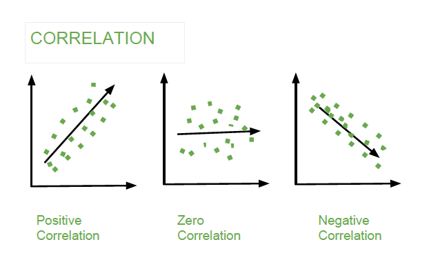

```{r, echo=FALSE, message=FALSE, warning=FALSE}
#| label: "setup"
#| include: false
knitr::opts_chunk$set(echo = TRUE)
library(readxl)
library(dplyr)
library(readr)
library(lessR)
library(ggplot2)
library(ggpubr)
library(ggpmisc)
library(ggbeeswarm)
library(broom)
library(cowplot)
library(patchwork)
library(palmerpenguins)
library(car)
library(ggforce) # for geom_circle
library(RVAideMemoire) #shapiro.test
library(DiagrammeR)
#knitr::opts_chunk$set(dpi= 100)
library(countdown)
library(knitr)
library(kableExtra)
```

## Basic Statistical analysis

-   Now we are going to cover how to perform a variety of basic statistical tests in R.
  1. T-tests
  2. Correlation 
  3. Linear Regression 
  4. One-way ANOVA

## Basic Statistical analysis

-   Now we are going to cover how to perform a variety of basic statistical tests in R.
  1. T-tests (independent and dependent)
  2. Correlation (Pearson, Spearman, Kendall)
  3. Linear Regression (Simple, Multiple, Logistic, )
  4. One-way ANOVA (Factorial ANOVA, Full Factorial ANOVA, Repeated Measures ANOVA)


## t-tests


## t-tests
:::: {.columns}

::: {.column width="50%"}
- A **t-test** is an inferential statistic used to determine if there is a statistically significant difference between the means of two variables.

- **Student t-test** is named after its inventor, William Gosset (English statistician, chemist and brewer), who published under the pseudonym of student.

:::

::: {.column width="50%"}
```{r, echo=FALSE, message=FALSE, warning=FALSE, fig.width=4.2, fig.height=4.6, dpi=250}
set.seed(1234)
wdata = data.frame(
  data = factor(rep(c("Sample 1", "Sample 2"), each=200)),
  weight = c(rnorm(200, 55), rnorm(200, 58)))

gghistogram(
  wdata, x = "weight", y = "..density..",
  add = "mean", rug = TRUE,
  fill = "data", palette = c("#00AFBB", "#E7B800"),
  add_density = TRUE
  )+
theme(plot.margin = margin(-10, 0, 0, 0, "pt"))  # Adjusts top margin

```
:::

::::

## When would you run a t-test?

1. You have a continuous response variable.
2. You want to test for a **difference between two sample means**: considering the variance within each group, do the groups belong to two distinct populations, or not?
3. Data is **normally distributed** and both groups have approximately **equal variance**.
4. If the groups are **not related** in any way = **Independent t-test**
5. If the groups are **related (paired)** = Dependent t-test (or matched pairs t-test).


## Independent vs. Dependent groups
- How do I know if my samples are independent or dependent?  

- Can you tell exactly which observation should be paired with which other observation?  If you can't tell, your groups are independent


## Independent vs. Dependent groups
:::: {.columns}

::: {.column width="50%"}
**Examples of Independent Samples**
1. Treated and untreated, randomly located plots.<br>
2. Monitoring sites set up with Systematic (grid) sampling.<br>
3. Infested and uninfested forest stands selected with stratified random sampling.
:::

::: {.column width="50%"}
**Examples of Dependent Samples**
1. Before and After data taken on the same observation.<br>
2. Paired watersheds / plots.<br>
3. Parent / offspring studies.<br>
4. Twin studies / partner studies. 
:::
  
::::

## t-tests
-   The T-test is performed using the `t.test()` function, which essentially tests for the difference in **means of a variable between two groups**. It can perform a one sample t-test, two sample t-test, and a paired t-test.

-   In this syntax `t.text(x, y)`, x and y are the columns of data for each group. It performs a two sample t-test assuming unequal variances.

```{r, eval=F}
t.test(x= , y = ,
       mu = 0, 
       paired = , 
       `var.equal= `, 
       alternative = c("two.sided", "less", "greater")
       )
```

## Example: Two-tailed t-test 

**Research Question**:  The state is looking to choose a stream for habitat restoration for native trout species.  Streams with deeper pools will provide necessary cover in the winter months and minimize potential scouring from severe rain events.  Which stream should they focus on?  Test to see if there is a significant difference in depth between stream 1 and stream 2?

```{r, warning=FALSE}
stream_data <- read.csv('data/t_test_two_tail_water data.csv')
head(stream_data)
```

## Step 1. Normality test

- Test for normality
```{r  warning=FALSE}
byf.shapiro(depth_cm~waterbody, data=stream_data)
```

## Step 2. Equal variance

```{r, warning=FALSE}
#var.test
var.test(depth_cm ~ waterbody, data=stream_data)
```

## Step 3: Conducting the t-test

```{r}
t.test(filter(stream_data, waterbody == "stream1")$depth_cm, 
       filter(stream_data, waterbody == "stream2")$depth_cm,
       alternative = "two.sided",
       mu = 0, 
       paired = FALSE, 
       var.equal = TRUE)
```

## Visualization
```{r, echo=TRUE, message=FALSE, warning=FALSE, fig.width=3, fig.height=3.5}
#| output-location: column
#| fig-align: center
ggplot(stream_data, aes(x = waterbody, 
                        y = depth_cm, 
                        fill = waterbody)) +
  geom_boxplot() +
  stat_summary(fun = mean, geom = "point", 
               shape = 5, size = 4, color = "black") +
  labs(title = "Depth Measurements in Stream 1 and Stream 2",
       x = "Waterbody",
       y = "Depth (cm)") +
  theme_minimal() +
  scale_fill_manual(values = 
                      c("#00AFBB", "#E7B800")) +
  theme(legend.position = "none")
```


## Correlation

## What is correlation?
- A correlation test quantifies how two variables change together.
  - Are the variables closely related?
  - To what extent does one variable predict the other?
```{r, echo=FALSE, fig.cap="", out.width = '50%'}
#| fig-align: center

```

## When to use correlation?
- Correlation test is used to **evaluate** the **association between two or more variables**.

- You have two continuous variables measured from the same observational unit.

- You want to determine if the variables are related (vary in unison).


## Key assumptions:
- Independent, random samples.

- Normality:
    - Pearson correlation (parametric): Assumes both variables follow a normal distribution.
    - Spearman correlation (nonparametric): Does not assume normality.

- Linear relationship: Correlation looks for a linear association between the variables.


## Describing correlations
- **Strength**: Indicates how closely the variables are related.
    - Categories: Weak, Moderate, Strong

- **Nature**: Shows the direction of the relationship.
    - Direct (Positive): As one variable increases, so does the other.
    - Indirect (Negative): As one variable increases, the other decreases.
  
- **Significance**: Assesses if the correlation is meaningful.
    - Based on the p-value, which tells us if the observed relationship is likely due to chance.

## Correlation in R
- `cor()` performs correlation in R

```{r eval=F}
cor(x, y = NULL, use = "everything",
    method = c("pearson", "kendall", "spearman"))
```


## Nature and Interpretation of $r$ Value

:::: {.columns}

::: {.column width="60%"}
- Perfect **Positive Correlation**: $r=+1$  

  - All points lie on an upward-sloping line.


:::

::: {.column width="40%"}

```{r, echo=FALSE, message=FALSE, warning=FALSE, fig.width=4, fig.height=4}
#| fig-align: center
set.seed(0)
n <- 50
x <- seq(1, 10, length.out = n)
y_positive <- x  # Perfect correlation: y = x

# Create a data frame
data_positive <- data.frame(x = x, y = y_positive)

# Plot
ggplot(data_positive, aes(x = x, y = y)) +
  geom_point(color = "blue") +
  geom_line(color = "blue") +
  labs(title = "Perfect Positive Correlation (r = +1)", x = "X", y = "Y") +
  theme_minimal()

```

:::
  
::::


## Nature and Interpretation of $r$ Value

:::: {.columns}

::: {.column width="60%"}
- Perfect Positive Correlation: $r=+1$
  - All points lie on an upward-sloping line.
  
- **No Correlation**: $r=0$
  - Points do not align along any line, or they form a horizontal line.

:::

::: {.column width="40%"}

```{r, echo=FALSE, message=FALSE, warning=FALSE, fig.width=4, fig.height=4}
#| fig-align: center
set.seed(0)
y_no_corr <- runif(n, 1, 10)  # Random y values, no correlation

# Create a data frame
data_no_corr <- data.frame(x = x, y = y_no_corr)

# Plot
ggplot(data_no_corr, aes(x = x, y = y)) +
  geom_point(color = "blue") +
  labs(title = "No Correlation (r = 0)", x = "X", y = "Y") +
  theme_minimal()

```

:::
  
::::


## Nature and Interpretation of $r$ Value

:::: {.columns}

::: {.column width="60%"}
- Perfect Positive Correlation: $r=+1$
  - All points lie on an upward-sloping line.
  
- No Correlation: $r=0$
  - Points do not align along any line, or they form a horizontal line.
  
- Perfect **Negative Correlation**: $r=−1$
  - All points lie on a downward-sloping line.

:::

::: {.column width="40%"}

```{r, echo=FALSE, message=FALSE, warning=FALSE, fig.width=4, fig.height=4}
#| fig-align: center
y_negative <- -x  # Perfect correlation: y = -x

# Create a data frame
data_negative <- data.frame(x = x, y = y_negative)

# Plot
ggplot(data_negative, aes(x = x, y = y)) +
  geom_point(color = "blue") +
  geom_line(color = "blue") +
  labs(title = "Perfect Negative Correlation (r = -1)", x = "X", y = "Y") +
  theme_minimal()

```

:::
  
::::


## Nature and Interpretation of $r$ Value

:::: {.columns}

::: {.column width="60%"}
- Perfect **Positive Correlation**: $r=+1$
  - All points lie on an upward-sloping line.
  
- No Correlation: $r=0$
  - Points do not align along any line, or they form a horizontal line.
  
- Perfect **Negative Correlation**: $r=−1$
  - All points lie on a downward-sloping line.

:::

::: {.column width="40%"}

```{r, echo=FALSE, message=FALSE, warning=FALSE, fig.width=4, fig.height=4}
#| fig-align: center
y_negative <- -x  # Perfect correlation: y = -x

# Create a data frame
data_negative <- data.frame(x = x, y = y_negative)

# Plot
ggplot(data_negative, aes(x = x, y = y)) +
  geom_point(color = "blue") +
  geom_line(color = "blue") +
  labs(title = "Perfect Negative Correlation (r = -1)", x = "X", y = "Y") +
  theme_minimal()

```

:::
  
::::

- Note: When $∣r∣=1$, we have a perfect correlation, meaning all points fall precisely along a straight line.


## Strength of Correlation

:::: {.columns}

::: {.column width="60%"}

- Weak Correlation: 
  - $0.0≤ ∣r∣ <0.3$

- Moderate Correlation: 
  - $0.3≤∣r∣<0.7$

- Strong Correlation: 
  - $0.7≤∣r∣0.9$
  
- Perfect Correlation: 
  - $∣r∣=1.0$

:::

::: {.column width="40%"}

```{r, echo=FALSE, message=FALSE, warning=FALSE, fig.width=4, fig.height=4}
#| fig-align: center
set.seed(123)  # For reproducibility

# Function to generate correlated data
generate_data <- function(n, r) {
  x <- rnorm(n)
  y <- r * x + sqrt(1 - r^2) * rnorm(n)
  data.frame(x = x, y = y)
}

# Generate datasets for each correlation strength
data_r0 <- generate_data(100, 0)       # Correlation of 0
data_r03 <- generate_data(100, 0.3)    # Correlation of 0.3
data_r07 <- generate_data(100, 0.7)    # Correlation of 0.7
data_r1 <- data.frame(x = rnorm(100))  # Correlation of 1
data_r1$y <- data_r1$x

# Create scatterplots for each correlation level
plot_r0 <- ggplot(data_r0, aes(x, y)) +
  geom_point() +
  ggtitle("No Correlation (r = 0)") +
  theme_minimal()

plot_r03 <- ggplot(data_r03, aes(x, y)) +
  geom_point() +
  ggtitle("Weak Correlation (r ≈ 0.3)") +
  theme_minimal()

plot_r07 <- ggplot(data_r07, aes(x, y)) +
  geom_point() +
  ggtitle("Moderate Correlation (r ≈ 0.7)") +
  theme_minimal()

plot_r1 <- ggplot(data_r1, aes(x, y)) +
  geom_point() +
  ggtitle("Perfect Correlation (r = 1)") +
  theme_minimal()

# Arrange plots in a single plate using patchwork
(plot_r0 | plot_r03) /
  (plot_r07 | plot_r1)

```

:::
  
::::

## Coefficient of Determination ( $r^2$ )
- $r^2$ **quantifies the proportion of variability in one variable that can be explained by its relationship with the other variable**.

- It represents the shared variability between the two variables, indicating how much of the total variability they have in common.

- When two variables are correlated, $r^2$ tells us how much variance in one variable can be accounted for by the other.

- This concept is similar to the Effect Size we examined in ANOVA.


## Difference between $r$ and $r^2$
- $r$ (Pearson’s Correlation Coefficient):

  - Measures how much two variables vary together.
    - Ranges from -1 to 1:
      - -1: Perfect negative correlation
      - 0: No correlation
      - 1: Perfect positive correlation
    - Unitless and applicable across contexts.


## Difference between $r$ and $r^2$
- $r$ (Pearson’s Correlation Coefficient):
  - Measures how much two variables vary together.
    - Ranges from -1 to 1:
      - -1: Perfect negative correlation
      - 0: No correlation
      - 1: Perfect positive correlation
    - Unitless and applicable across contexts.

- $r^2$ (Coefficient of Determination):
  - Indicates the proportion of variability explained by the relationship.
    - Ranges from 0 to 1:
      - 0: No variability explained
      - 1: All variability explained
    - Interpreted as the percentage of variance explained.

## Example: Correlation

## Relationship between CO₂ and Global Temperature

**Load Data**: Import the dataset containing global temperature and CO₂ concentration.

```{r}
global_T <- read_xlsx('data/correlation global mean T.xlsx')
tail(global_T)
```


## Relationship between CO₂ and Temperature

**Test for Normality**: Use Shapiro-Wilk tests to check if temperature and Mona_Loa_co2 are normally distributed.

```{r highlight.output = 5}
shapiro.test(global_T$temperature)
```

## Relationship between CO₂ and Temperature

**Test for Normality**: Use Shapiro-Wilk tests to check if temperature and Mona_Loa_co2 are normally distributed.

```{r highlight.output = 5}
shapiro.test(global_T$Mona_Loa_co2)
```

## Relationship between CO₂ and Temperature
This code performs a **Spearman correlation** test to examine the relationship between global temperature and CO₂ concentration.

```{r highlight.output = c(5,9)}
#Test correlation (parametric)
test <- cor.test(global_T$temperature,
         global_T$Mona_Loa_co2,
         method = "spearman")
test
```


## Coefficient of Determination (R²) for Spearman Correlation
Approximate the proportion of variance in temperature explained by CO₂ concentration.

```{r}
rho <- test$estimate  # Spearman correlation coefficient
R_squared <- rho^2
R_squared

# Extract correlation coefficient and p-value
p_value <- test$p.value
```


## Data visualization
```{r, echo=TRUE, message=FALSE, warning=FALSE, fig.width=5, fig.height=6}
#| output-location: column
#| fig-align: center
ggplot(global_T, 
       aes(x = Mona_Loa_co2, 
           y = temperature)) +
  geom_line() +
  geom_point() +
  geom_smooth() +
  #  ylim(14,14.75) +
  labs(x = "CO2 (ppm)", 
       y = "Temperature (C)", 
       title = "") +
  annotate("text", x = 375, y = 14.8, 
           label = paste("Spearman's correlation =", 
                 round(rho, 2), "\n", 
                 "p =", format.pval(p_value)),
           hjust = 1, vjust = 0)
```

## Linear Regression 

## What is regression?
- Regression analysis is a generic term for a group of different statistical techniques. 

- The purpose of all these techniques is to examine the relationship between variables.
<br>
      - Regression aims to find the **best-fitting linear equation ( $Y = \beta_0 + \beta_1 X_1 + \epsilon$ )** that describes the relationship between the dependent variable (often denoted as $Y$ ) and independent variables (denoted as $X1, X2, ..., Xn$ ). 


## What can we accomplish with linear regression?
:::: {.columns}

::: {.column width="50%"}
1. Describing the nature of the relationship between two variables.
:::

::: {.column width="50%"}
```{r, echo=FALSE, message=FALSE, warning=FALSE, fig.width=4, fig.height=4}
#| fig-align: center
set.seed(14)
x <- seq(0, 22, by = 2)
y <- 0.3 * x + rnorm(length(x), mean = 0, sd = 0.5)  # Generate some example data with noise
df <- data.frame(x = x, y = y)

# Fit linear model
model <- lm(y ~ x, data = df)
intercept <- coef(model)[1]
slope <- coef(model)[2]

# Create ggplot with linear model fit to data and equation
p <- ggplot(data = df, aes(x = x, y = y)) +
  geom_smooth(method = "lm", color = "black", se=F, linewidth=0.8) +
  geom_point(color = "red", size = 1.5) +
  theme_bw() +
  scale_y_continuous(limits = c(0, 10), name = "Dependent Variable (Y)") +
  scale_x_continuous(limits = c(0, 30), name = "Independent Variable (X)") +
  annotate("text", x = 5, y = 8, label = paste0("Y = ", round(intercept, 2), " + ", round(slope, 2), "X"), color = "blue", size = 4) +
  theme(plot.margin = unit(c(0,0,0,0), "cm"))

p

```  
:::

::::

## What can we accomplish with linear regression?
:::: {.columns}

::: {.column width="50%"}
1. Describing the nature of the relationship between two variables.

2. Predicting the dependent variable within the range of observed values. Aim to forecast y-values within the range of observed x-values. Offers relatively more certainty due to reliance on known data.
:::

  
::: {.column width="50%"}
```{r, echo=FALSE, message=FALSE, warning=FALSE, fig.width=6, fig.height=5}
#| fig-align: center
set.seed(14)
x <- seq(0, 22, by = 2)
y <- 0.3 * x + rnorm(length(x), mean = 0, sd = 0.5)  # Generate some example data with noise
df <- data.frame(x = x, y = y)

# Initial ggplot with linear model fit to data
p <- ggplot(data = df, aes(x = x, y = y)) +
  geom_smooth(method = "lm", color = "black", se=T, linewidth=0.8) +
  geom_point(color = "red", size = 1.5) +
  theme_bw() +
  scale_y_continuous(limits = c(0, 10), name = "Dependent Variable (Y)") +
  scale_x_continuous(limits = c(0, 30), name = "Independent Variable (X)") +
  theme(plot.margin = unit(c(0,0,0,0), "cm"))

# Fit a linear model to the data
model <- lm(y ~ x, data = df)

# Choose a random x value within the extrapolated range (e.g., x = 25)
random_x <- 15
random_y <- predict(model, newdata = data.frame(x = random_x))

p + geom_segment(aes(x = random_x, xend = random_x, y = 0, yend = random_y), color = "red", linetype = "dashed") +  # Vertical line stopping at the fitted line
  geom_segment(aes(x = 0, xend = random_x, y = random_y, yend = random_y), color = "red", linetype = "dashed") +  # Horizontal line stopping at the fitted line
  annotate("text", x = 10, y = random_y + 0.5, label = paste("Predicted y =", round(random_y, 2)), color = "red")

```
:::
  
::::


## What can we accomplish with linear regression?
:::: {.columns}

::: {.column width="50%"}
1. Describing the nature of the relationship between two variables.

2. Predicting the dependent variable within the range of observed values. Aim to forecast y-values within the range of observed x-values. Offers relatively more certainty due to reliance on known data.
3. Predicting the dependent variable beyond the range of observed values.
    - Represents an exploration beyond the limits of observed data.
    - Naturally, this type of objective carries the greatest load of restrictions, assumptions, caveats, and risk of error.
:::

  
::: {.column width="50%"}
```{r, echo=FALSE, message=FALSE, warning=FALSE, fig.width=6, fig.height=5}
#| fig-align: center
set.seed(14)
x <- seq(0, 22, by = 2)
y <- 0.3 * x + rnorm(length(x), mean = 0, sd = 0.5)  # Generate some example data with noise
df <- data.frame(x = x, y = y)

# Initial ggplot with linear model fit to data
p <- ggplot(data = df, aes(x = x, y = y)) +
  geom_smooth(method = "lm", color = "black", se=T, linewidth=0.8) +
  geom_point(color = "red", size = 1.5) +
  theme_bw() +
  scale_y_continuous(limits = c(0, 10), name = "Dependent Variable (Y)") +
  scale_x_continuous(limits = c(0, 30), name = "Independent Variable (X)") +
  theme(plot.margin = unit(c(0,0,0,0), "cm"))

# Fit a linear model to the data
model <- lm(y ~ x, data = df)

# Create new data frame for extrapolation from x = 22 to 30
new_x <- data.frame(x = seq(22, 30, by = 1))
predictions <- predict(model, newdata = new_x, interval = "confidence", level = 0.95)
newdf <- cbind(new_x, predictions)

# Add extrapolated line and confidence ribbon to the plot
p + 
 # geom_ribbon(data = newdf, aes(x = x, ymin = lwr, ymax = upr), fill = "grey90") +
  geom_line(data = newdf, aes(x = x, y = fit), color = 'steelblue', lwd = 1.2, lty = 2) +
  ggtitle("")

```
:::
  
::::


## When to use a Simple Linear Regression
- You have two continuous variables measured in the same unit.
- You suspect the variables are related and vary in unison.
- You aim to predict one variable based on the other.
- You want to evaluate a trend (slope) over multiple measurements.


## Assumptions 
- Linear regression algorithm assumes the following:
    - Linear relationship: The dependent and independent variables are linearly related.
    - No multicollinearity: Independent variables should not be highly correlated.
    - Homoscedasticity: The error term should remain constant across all levels of the independent variables.
    - Normal distribution of error terms: Error terms should follow a normal distribution.
    - No autocorrelation: The error terms should not show patterns.


## Mathematically
- The simple linear model is defined as:

$$
Y = \beta_0 + \beta_1 X + \epsilon
$$

- Where:
  - $Y$ is the dependent variable.
  - $X$ is the independent variable.
  - $\beta_0$ is the intercept.
  - $\beta_1$ is the slope of the line.
  - $\epsilon$ is the error term.


## Mathematically
- The multiple linear model is defined as:

$$
Y = \beta_0 + \beta_1 X_1 + \beta_2 X_2 + \dots + \beta_p X_p + \epsilon
$$

- Where:
  - $Y$ is the dependent variable.
  - $X_1, X_2, \dots, X_p$ are the independent variables.
  - $\beta_0$ is the intercept.
  - $\beta_1, \beta_2, \dots, \beta_p$ are the coefficients (slopes) for each predictor.
  - $\epsilon$ is the error term.


## Linear Models in R
- `lm()` fits linear models in R
<br>
  - Simple linear regression
```{r eval=F}
lm(Y ~ X, data = dataset)
```
- where:
    - y is your outcome
    - x is your predictor


## Linear Models in R
- `lm()` fits linear models in R
  - Multiple linear regression
```{r eval=F}
lm(Y ~ X1 + X2 + X3, data = dataset)
```
- where:
    - y is your outcome
    - x is/are your predictor(s)


## Example: Simple linear regression
```{r, warning=FALSE}
lion_data <- read_excel("data/SLR_lion.xlsx")
head(lion_data)
```


## Step 1. Visualize the data
```{r, echo=TRUE, message=FALSE, warning=FALSE, fig.width=5, fig.height=4.5}
#| output-location: column
#| fig-align: center
p <- ggplot(lion_data, 
            aes(x = proportionBlack, 
                y = ageInYears)) +
  geom_point(size=3) +
  xlab('Proportion Black in Nose') + 
  ylab('Age (years)') +
  geom_smooth(method='lm', 
              se=F)
p
```

## Step 2. Fit the linear model
```{r}
mod <- lm(ageInYears~proportionBlack, data = lion_data)
summary(mod)
```


## Step 3. Check model assumpltions: Normality
- Get list of residuals to nest normality
```{r}
res <- resid(mod)
shapiro.test(res)
```


## Residuals plot
- Create residual plot
```{r}

ggplot(mod, aes(x = .fitted, y = .resid)) +
  geom_point(size=3) +  
  geom_hline(yintercept = 0, color = "red") +
  labs(title = "Residuals Plot",
       x = "Index",
       y = "Residuals")
```

## Analysis Of Variance (ANOVA)


## What is ANOVA?
- ANOVA (Analysis of Variance) is a statistical technique used to analyze the relationship between categorical variables and continuous variables in R.

- This statistical method is an extension of the independent samples t-test for comparing the means in a situation where **there are more than two groups**.


## Hypothesis in one-way ANOVA test
:::: {.columns}

::: {.column width="50%"}
- $H_0$: All group means are equal.

  - $H_0: \mu_1 = \mu_2 = \mu_3 = \dots = \mu_k$
<br><br>  
- $H_a$: At least, the mean of one group is different

  - $H_A: \mu_i \neq \mu_j \quad \text{for some } i, j$
:::

  
::: {.column width="50%"}
```{r, echo=FALSE, message=FALSE, warning=FALSE, fig.width=5, fig.height=4.5}
#| output-location: column
#| fig-align: center
# Simulate data for three groups
set.seed(123)
data <- data.frame(
  Group = rep(c("Group 1", "Group 2", "Group 3"), each = 30),
  Value = c(rnorm(30, mean = 50, sd = 5),  # Group 1
            rnorm(30, mean = 50, sd = 5),  # Group 2 (same mean as Group 1)
            rnorm(30, mean = 55, sd = 5))  # Group 3 (different mean)
)

# Calculate the means for each group
group_means <- aggregate(Value ~ Group, data, mean)

# Create the density plot with vertical lines at the means
ggplot(data, aes(x = Value, fill = Group)) +
  geom_density(alpha = 0.6) +
  geom_vline(data = group_means, aes(xintercept = Value, color = Group),
             linetype = "dashed", size = 1) +
  theme_minimal() +
  labs(title = "",
       x = "Value", y = "Density") +
  scale_fill_brewer(palette = "Set2") +
  scale_color_brewer(palette = "Set2", guide = "none")
```
:::
  
::::


## When would you run an ANOVA?
- I have a continuous response variable.

- I want to know the difference in that response between more than two groups.

- I have one factor I am testing (One-Way ANOVA).


## Assumptions
- There are three key assumptions that you need to be aware of: 

  1. All groups are Independent.

  2. The data is normally distributed.

  3. All groups have approximately equal variance.
      * A good rule of thumb: ratio of largest to smallest group stdev must be less than 2:1
      * The ANOVA is less sensitive to this requirement when samples are of equal size from each population.


## Assumptions

- A common misconception is that the **response variable** must be normally distributed when conducting an ANOVA. This is **incorrect** because the normality assumptions pertain to the **residuals**, not the response variable.


## Assumptions

- A common misconception is that the **response variable** must be normally distributed when conducting an ANOVA. This is **incorrect** because the normality assumptions pertain to the **residuals**, not the response variable.

- The key assumption of ANOVA is that the **residuals** **are independent** and come from a **normal distribution** with mean 0 and variance $\sigma^2$. Specifically:
<center>
$y_{ij} = \mu + \alpha_i + \epsilon_{ij}$
</center>
Where:
- $y_{ij}$ This is the observed value of the response variable for the $j$-th observation in the $i$-th group
- $\mu$ is the overall mean
- $\alpha_i$ is the effect of the $i$-th group
- $\epsilon_{ij} \sim \text{Normal}(0, \sigma^2)$, where $\epsilon_{ij}$ represents the residual error.


## How ANOVA works 

## How ANOVA works 
- The ANOVA obtained value (the **F-statistic**) is a ratio of the Between Group Variation divided by the Within Group Variation:      

$$F = \frac{\text{Between-group variance}}{\text{Within-group variance}}$$ 

- A large **F** is evidence against $H_0$, since it indicates that there is more difference between groups than within groups.


## One-way ANOVA Formulas
:::: {.columns}

::: {.column width="50%"}
- The formula for the Sum of Squares Between (SSB) is given by:
$$ SSB = \sum_{j=1}^{C} n_j (\bar{x}_j - \bar{x})^2 $$

- Where:
  - $C$ = number of groups
  - $n_j$ = sample size of group $j$
  - $\bar{x}_j$ = mean of group $j$
  - $\bar{x}$ = overall mean
:::

  
::: {.column width="50%"}
- The formula for the Sum of Squares Within (SSW) is given by:  

$$SSW = \sum_{j=1}^{C} \sum_{i=1}^{n_j} (\bar{x}_j - \bar{x})^2$$

- Where:
  - $C$ = number of groups
  - $n_j$ = sample size of group $j$
  - $\bar{x}_j$ = mean of group $j$
  - $\bar{x}$ = overall mean
:::
  
::::

## Example: One-way ANOVA
```{r}
crop <- read.csv('data/ANOVA_crop.csv')
head(crop)
```

## Data visualization
- Visualize the data distribution using boxplots and jitter for individual points:

```{r, echo=TRUE, message=FALSE, warning=FALSE, fig.width=5, fig.height=4.5}
#| output-location: column
#| fig-align: center
ggplot(crop) +
  aes(x = fertilizer, y = yield, 
      fill = fertilizer) +
  geom_boxplot() +
    geom_jitter(shape = 15,
        color = "steelblue",
        position = 
          position_jitter(0.21)) +
   theme_minimal()
```


## Running the ANOVA
- Run one-way ANOVA to assess differences between fertilizer groups:
```{r}
one.way <- aov(yield ~ fertilizer, 
               data = crop, var.equal = TRUE )

summary(one.way)
```

## Checking Assumptions: Normality

## Checking Assumptions: Normality
- Check normality of residuals using a QQ plot and the Shapiro-Wilk test.

:::: {.columns}
::: {.column width="50%"}
```{r, fig.width=4.5, fig.height=4.5}
plot(one.way, 2) 
```
:::

::: {.column width="50%"}
- Compute Shapiro-Wilk test of normality
```{r highlight.output = 5}
shapiro.test(residuals(one.way))
```
:::
::::

## Check Assumptions: Homogeneity of Variances
The homogeneity of variances can also be checked using **Bartlett's**.
```{r highlight.output = 5}
bartlett.test(yield ~ fertilizer, data=crop)
```


## Post-hoc test

## Why Perform a Post-hoc Test?

- When the **overall p-value** from the ANOVA is below the significance level (typically p < 0.05), it suggests that **at least one group mean is different from the others**.

- However, ANOVA does not specify which groups are different; it only tells us that **not all group means are equal**.

- To pinpoint which groups differ, we need to conduct a **post-hoc test**. This test controls for the family-wise error rate, ensuring accurate comparisons between group means.

