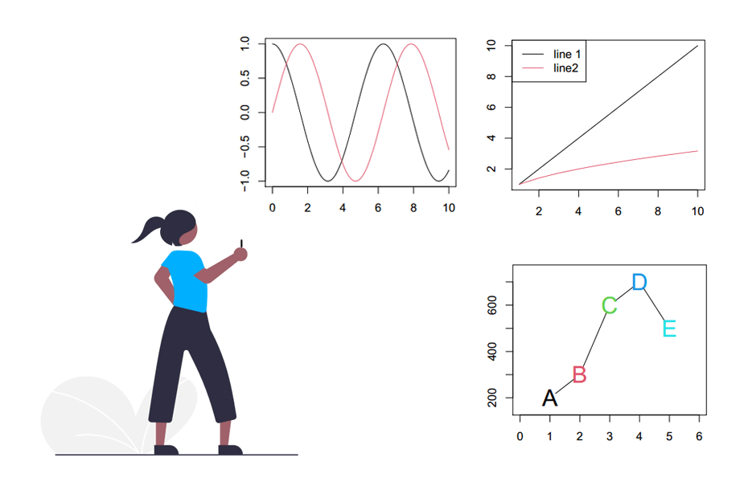
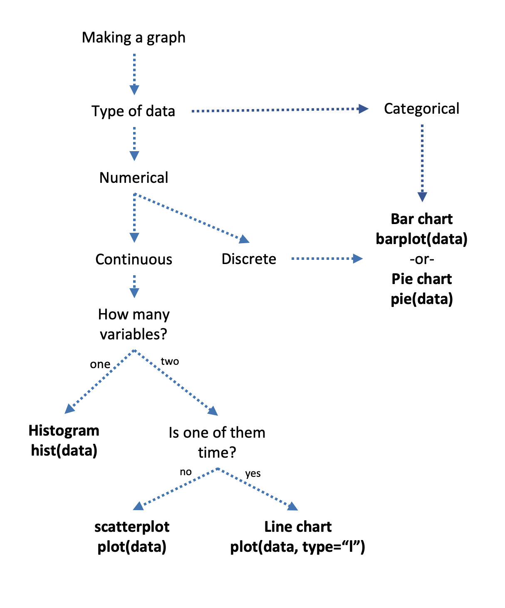
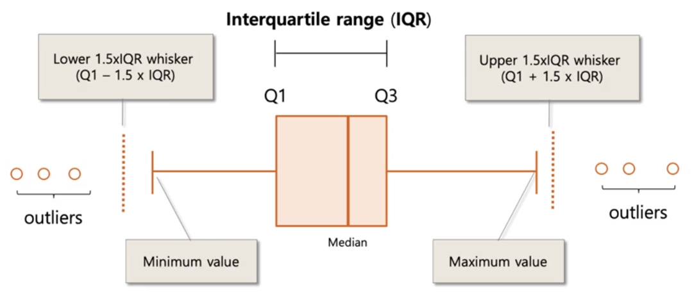

```{r, echo=FALSE, message=FALSE, warning=FALSE}
library(readxl)
library(dplyr)
library(readr)
library(lessR)
library(ggplot2)
library(ggpubr)
library(cowplot)
library(patchwork)
library(palmerpenguins)
library(car)
library(ggforce) # for geom_circle
library(RVAideMemoire) #shapiro.test
library(DiagrammeR)
#knitr::opts_chunk$set(dpi= 100)
library(countdown)
library(knitr)
library(kableExtra)
xaringanExtra::use_panelset()
xaringanExtra::use_scribble()
xaringanExtra::use_search(show_icon = FALSE, position= "bottom-left") # Search
xaringanExtra::use_progress_bar(color = "#0051BA", location = "bottom", 
                                height = "4px")
xaringanExtra::use_clipboard() # Copy Code 
xaringanExtra::use_extra_styles(
  hover_code_line = TRUE,         #<<
  mute_unhighlighted_code = TRUE  #<<
)
xaringanExtra::use_editable(expires = 1) # Add textboxes to edit during presentation
```

<center>
<br><br><br><br>

</center>

---
exclude: true
https://pkg.garrickadenbuie.com/countdown/#1
```{r, echo=FALSE}
countdown::countdown(minutes=1,seconds= 0, right = "33%", bottom = "0%", warn_when = 30)
```

https://bookdown.org/jgscott/DSGI/plots.html

---
# Plots in Base R

- There are many types of statistical plots, but only five essential ones for beginners:
    - Bar plots – show summary statistics (e.g., counts, means, or proportions).
    - Scatter plots – show relationships among numerical variables.
    - Line graphs – show change over time.
    - Histograms – show data distributions.
    - Boxplots – show between-group and within-group variation.

- These five plots cover a broad range of data-science situations.

---
# Plots in Base R
- In this lesson, you will learn to:
    - Understand the grammar of graphics.
    - Create the five basic plots listed above.
    - Use faceting and aesthetic variation (e.g., color) to represent multivariate information.
    - Customize plots with advanced control over their visual details.


---
# Plots in Base R
- In this lesson, you will learn to:
    - Understand the grammar of graphics.
    - Create the five basic plots listed above.
    - Use faceting and aesthetic variation (e.g., color) to represent multivariate information.
    - Customize plots with advanced control over their visual details.

- Before we dive into data visualization, we’ll do a brief review (or introduction, for some of you) to statistics, since most plots are used to graph statistical results.

---
# Plots

<center>
```{r, echo=FALSE, fig.cap="", out.width = '45%'}

```
</center>

---
# Thinking like a statistician

- **Variable:** a quantity counted or measured the characteristic that is being observed. 

  1. Quantitative Variables
  2. Qualitative Variables

---
# Thinking like a statistician

.pull-left[
- **Quantitative Variables:** a measurable **amount**.
    1. **Continuous variable:**  may assume any imaginable value within a certain range. Can (theoretically) have an infinite number of values.
      - Weights, Heights

    2. **Discrete Variables:**  countable as integers (whole numbers). No values between two adjacent values are permissible.
      - Number of bicycles sold in a day.

] 
.pull-right[

.center[

```{r, echo=FALSE}
mermaid("graph TB
    A[Quantitative data] --> |measuring| Continuous
    A[Quantitative data] --> |counting| Discrete",

height = '100%', width = '100%')
```
]
]

---
# Thinking like a statistician

- **Qualitative Variables:** descriptive characteristic assignable to a category.
    1. **Nominal Variables**: measurements fall into a particular class or category with no order implied.
        - sex (male or female), color (red, blue, green).

    2. **Ordinal Variables:** a ranking scale where order between categories is implied.
        - Likert scale (strongly agree, agree, neutral, disagree, strongly disagree).  

    3. **Interval (ratio) Variables:** use a quantitative measurement to assign a specific qualitative category (these are still ordinal).
        - Temperature (cold, warm, hot), age (young, middle-aged, old).
        
---
# Plots in Base R

---
# Barplots

---
# Plots in Base R: Barplots

---
# Plots in Base R: Barplots

In a bar chart, values are represented by the length of bars, each corresponding to a measured group.

.pull-left[
- Bar charts can be vertical or horizontal:
    - Vertical bar charts are often called column charts.
    - Horizontal bar charts are ideal when:
        - You have many bars to plot, or
        - Labels need extra space to be legible.
]        
        
.pull-left[
<center>
```{r, echo=FALSE, fig.cap="", out.width = '80%'}
knitr::include_graphics("figs/bar-chart.png")
```
</center>
]

---
# Dataset: DNase (built-in in R) 
- We will use [barplot()](https://www.rdocumentation.org/packages/graphics/versions/3.6.2/topics/barplot) function to create a barplot of the mean optical density for each substrate concentration.
```{r}
# Load dataset
data(DNase)
```

- Variables:
- `conc` → substrate concentration (in mg/mL).
- `density` → optical density, representing the experimentally measured enzymatic activity.
- `Run` → experimental run or replicate number (factor with 11 levels).

---
# `barplot()` function
- R Language uses the function barplot() to create bar charts. Here, both vertical and Horizontal bars can be drawn.  
<br>

- Syntax: `barplot(H, names.arg, xlab, ylab, main, col)`  
<br>

- Parameters:
  - H: This parameter is a vector or matrix containing numeric values which are used in bar chart.
    - names.arg: This parameter is a vector of names appearing under each bar in bar chart.
  - xlab: This parameter is the label for x axis in bar chart.
  - ylab: This parameter is the label for y axis in bar chart.
  - main: This parameter is the title of the bar chart.
  - col: This parameter is used to give colors to the bars in the graph.

---
# Dataset: DNase (built-in in R)

```{r}
# Step 1: Inspect data
head(DNase, 3)
# Variables:
# conc = concentration of the substrate
# density = optical density (enzyme activity)
# Run = experimental replicate
```

---
# Dataset: DNase (built-in in R)
- We use `aggregate()` to summarize the 11 experimental runs and visualize the average enzymatic activity at each concentration.

```{r}
# Step 2: Calculate mean density per concentration
mean_density <- aggregate(density ~ conc, data = DNase, FUN = mean)
```


---
# Dataset: DNase (built-in in R)
.panelset[
.panel[.panel-name[R Code]
```{r oplot, fig.show='hide', fig.width=7, fig.height=5.5}
# Step 3: Create barplot
barplot(
  height = mean_density$density, # height is a vector of numeric values that determines the height of each bar
  names.arg = mean_density$conc, # names.arg is a vector of names of each bar
  col = "lightblue",
  border = "gray30", 
  main = "Mean DNase I Activity by Concentration", # Main title of the plot
  xlab = "Concentration (mg/mL)", # Label for the X-axis
  ylab = "Mean Optical Density", # Label for the Y-axis
  las = 2,          # rotate labels for clarity
  cex.names = 0.8  # adjust label size
) # Don't forget to close the parenthesis
```
]

.panel[.panel-name[Plot]
`)
]
]

---
# Dataset: DNase (built-in in R)
- Simple Horizontal Bar Plot

.panelset[
.panel[.panel-name[R Code]
```{r Plot0, fig.show='hide', fig.width=7, fig.height=5.5}
# Step 3: Create barplot
barplot(
  height = mean_density$density,
  names.arg = mean_density$conc,
  col = "lightblue",
  border = "gray30",
  main = "Mean DNase I Activity by Concentration",
  xlab = "Concentration (mg/mL)",
  ylab = "Mean Optical Density",
  las = 2,          
  cex.names = 0.8,   
  horiz = TRUE      # make bars horizontal
)
```
]

.panel[.panel-name[Plot]
`)
]
]

---
# Scatter plots

---
# Plots in Base R: Scatter plots

---
# Plots in Base R: Scatter plots
- Scatter plots are used to display the **relationship between two continuous variables**.
- Each point on the plot represents one observation, with its position defined by values on the x and y axes.
- They are especially useful for detecting patterns, trends, clusters, or outliers in your data.
- In R, scatter plots can be created easily using the `plot()` function, allowing you to customize colors, symbols, and labels to enhance interpretation.

---
# Dataset: `coronary`
- The dataset contains the total cholesterol level, their individual characteristics and intervention groups in a hypothetical clinical trial. The dataset contains 200 observations for nine variables:


```{r}
library(readxl)
# Load in R:
coronary <- read_excel("data/coronary.xlsx")
```

---
# Dataset: `coronary`
- Examine our data:
```{r}
head(coronary, 3)
```


---
# Dataset: `coronary`
- The dataset contains the total cholesterol level, their individual characteristics and intervention groups in a hypothetical clinical trial. The dataset contains 200 observations for nine variables:

- Variables
  - id: Subjects’ ID.
  - cad: Coronary artery disease status (categorical) {no cad, cad}.
  - sbp : Systolic blood pressure in mmHg (numerical).
  - dbp : Diastolic blood pressure in mmHg (numerical).
  - chol: Total cholesterol level in mmol/L (numerical).
  - age: Age in years (numerical).
  - bmi: Body mass index (numerical).
  - race: Race of the subjects (categorical) {malay, chinese, indian}.
  - gender: Gender of the subjects (categorical) {woman, man}.
  

---
# Dataset: `coronary`
.panelset[
.panel[.panel-name[R Code]
```{r Plot2, fig.show='hide', fig.width=7, fig.height=5.5}
# Create a line chart
plot(
  coronary$dbp ~ coronary$chol,
  type = "p",                      # line plot
  col = "blue",                    # line color
  lwd = 2,                         # line width
  xlab = "Total Cholesterol (mmol/L)",  # x-axis label
  ylab = "Diastolic Blood Pressure (mmHg)", # y-axis label
  main = "Relationship between Cholesterol and Diastolic BP"
)
```
]

.panel[.panel-name[Plot]
`)
]
]

---
# Spearman Correlation: chol vs dbp
- The Spearman correlation evaluates the monotonic (rank-based) relationship between 
cholesterol and diastolic blood pressure.
```{r}
spearman_result <- cor.test(
  coronary$chol,
  coronary$dbp,
  method = "spearman",
  exact = FALSE # avoids warnings with tied ranks
)

```

---
# Spearman Correlation: chol vs dbp

```{r}
# Print results
spearman_result
```


---
# Spearman Correlation: chol vs dbp

- Spearman’s rho (ρ) indicates the strength and direction of the monotonic relationship.
- p-value assesses whether this relationship is statistically significant.
- For example:
  - ρ > 0 → higher cholesterol tends to accompany higher diastolic BP.
  - ρ < 0 → higher cholesterol tends to accompany lower diastolic BP.

---
# Test for Normality
- Let’s check if chol and dbp are normally distributed (as a comparison to why we might prefer Spearman over Pearson).
```{r}
shapiro.test(coronary$chol)
```

---
# Test for Normality
- Let’s check if chol and dbp are normally distributed (as a comparison to why we might prefer Spearman over Pearson).
```{r}
shapiro.test(coronary$dbp)
```

---
# Visualization
.panelset[
.panel[.panel-name[R Code]
```{r Plot3, fig.show='hide', fig.width=7, fig.height=5.5}
# Create a line chart
plot(
  coronary$dbp ~ coronary$chol,
  type = "p",                      # line plot
  col = "blue",                    # line color
  lwd = 2,                         # line width
  xlab = "Total Cholesterol (mmol/L)",  # x-axis label
  ylab = "Diastolic Blood Pressure (mmHg)", # y-axis label
  main = "Relationship between Cholesterol and Diastolic BP"
)

abline(lm(dbp ~ chol, data = coronary), col = "red", lwd = 2,lty = 2)
```
]

.panel[.panel-name[Plot]
`)
]
]

---
# Line charts

---
# Plots in Base R: Line charts

---
# Plots in Base R: Line charts

.pull-left[
- Line charts show changes in value **across continuous measurements**, such as over time.
- Movement of the line up or down highlights positive or negative changes.
- Line charts can expose overall trends and help make predictions or projections.
- Multiple line charts can also give rise to related charts like sparklines or ridgeline plots.
]

.pull-right[
```{r, echo=FALSE, fig.cap="", out.width = '80%'}
knitr::include_graphics("figs/line-chart.png")
```
<center>
]

---
# `plot()` function
- To create a line graph in R, we use the `plot()` function. 
- Syntax: `plot(v, type, col, xlab, ylab, main)`
- Parameters:
    - v: A vector containing the numeric values to be plotted.
  - type: Specifies the type of graph ("p" only points, "l" only lines, "o" both points and lines).
  - xlab: Label for the x-axis.
  - ylab: Label for the y-axis.
  - main: Title of the chart.
  - col: Specifies the color for the points and lines.


---
# `plot()` function
.panelset[
.panel[.panel-name[R Code]
```{r Plot4, fig.show='hide', fig.width=7, fig.height=5.5}
# Asegúrate de que los datos estén ordenados por edad
coronary <- coronary[order(coronary$age), ]
# Gráfico de líneas básico
plot(coronary$age, coronary$chol,
     type = "l", # "l" = line plot
     col = "blue",
     lwd = 2,
     xlab = "Age (years)",
     ylab = "Cholesterol (mmol/L)",
     main = "Cholesterol vs Age")
```
]

.panel[.panel-name[Plot]
`)
]
]

---
# Histograms

---
# Plots in Base R: Histograms

---
# Plots in Base R: Histograms
- Histograms are used to visualize the distribution of a single continuous variable.
- They show how often data values fall within specific intervals (bins).
- Useful for identifying the shape of the data (e.g., normal, skewed, bimodal) and detecting outliers or spread in the dataset.
- In R, histograms can be created using the `hist()` function, which allows customization of the number of bins, colors, and labels. 

---
# `hist()` function

.panelset[
.panel[.panel-name[R Code]
```{r Plot5, fig.show='hide', fig.width=7, fig.height=5.5}
hist(coronary$chol,
main = "Distribution of Cholesterol",
xlab = "Cholesterol (mmol/L)",
col = "lightblue",
border = "white",
# breaks = 10,   # You can cange the number
)
```
]

.panel[.panel-name[Plot]
`)
]
]

---
# Boxplots

---
# Plots in Base R: Boxplots
- Boxplots (or box-and-whisker plots) are used to visualize the distribution of a numeric variable and detect outliers.

.pull-left[
- They display:
  - Median (central line inside the box)
  - Interquartile range (IQR) — the box spans from the 25th (Q1) to the 75th percentile (Q3)
  - Whiskers, which extend up to 1.5×IQR from the box
  - Points beyond whiskers represent potential outliers
]

.pull-right[

<center>
<br><br>

</center>

]
---
# `boxplot()` function
- In R, boxplots can be created using the `boxplot()` function, which allows customization of colors, labels, and grouping by categorical variables.

.panelset[
.panel[.panel-name[R Code]
```{r Plot6, fig.show='hide', fig.width=6, fig.height=5.5}
boxplot(coronary$chol,
        main = "Cholesterol Levels",
        ylab = "Cholesterol (mmol/L)",
        col  = "lightgreen",
        border = "darkgreen"
)
```
]

.panel[.panel-name[Plot]
`)
]
]

---
# `boxplot()` function

.panelset[
.panel[.panel-name[R Code]
```{r Plot7, fig.show='hide', fig.width=7, fig.height=5.5}
# Boxplot de SBP por grupo de edad
boxplot(sbp ~ gender,
        data = coronary,
        main = "Systolic Blood Pressure by Age Group",
        xlab = "Age Group (years)",
        ylab = "Systolic BP (mmHg)",
        col = "lightblue",
        border = "darkblue"
)
```
]

.panel[.panel-name[Plot]
`)
]
]

---
# Analisys of Varianza (`anova()`)
- We can use ANOVA to test whether mean systolic blood pressure (SBP) differs across age groups or genders.

```{r}
anova_model <- aov(sbp ~ gender, data = coronary)
summary(anova_model)
```

---
# Assumptions of ANOVA:
- Normality – residuals should be approximately normally distributed. We check this using the Shapiro-Wilk test: `shapiro.test(residuals(anova_model))`.
```{r}
# 1. Shapiro-Wilk test on residuals
shapiro.test(residuals(anova_model))
```

---
# Assumptions of ANOVA:
- Homogeneity of variance – variance across groups should be similar (can be checked with `bartlett.test()`).

```{r}
bartlett.test(sbp ~ gender, data = coronary)
```

- Since the p-value < 0.05, we reject the null hypothesis of equal variances.
- This means the variance of SBP differs between genders, violating the homogeneity assumption of ANOVA.
